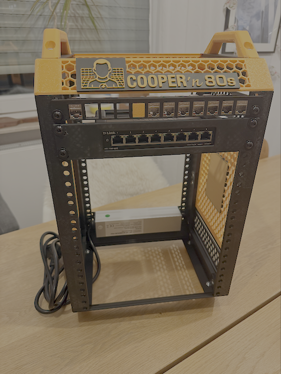

# Cooper'n'80s - Enterprise Kubernetes Homelab

<p align="center">
  
</p>

> Enterprise-grade Kubernetes lab for hands-on architectural learning

---

### 📺 Latest Episodes
**[S01E05 - The Network Foundation](docs/99-appendix/project-journal.md#s01e05---the-network-foundation)** *(Aug 23)* - Enterprise DNS/DHCP stack with cooper.lab domain  
**[S01E04 - The Infrastructure Revolution](docs/99-appendix/project-journal.md#s01e04---the-infrastructure-revolution)** *(Aug 20)* - Enterprise platform deployment & Vault integration  
**[S01E03 - The Assembly Protocol](docs/99-appendix/project-journal.md#s01e03---the-assembly-protocol)** *(Aug 19)* - Frame assembly & equipment delivery

**[📖 Full Project Journal](docs/99-appendix/project-journal.md)** - *Complete episode guide with Cooper'scher commentary*

---

## 🎯 Project Overview

Enterprise Architect's learning laboratory combining **theoretical knowledge** with **practical implementation**. Built to bridge the gap between architecture decisions and operational reality.

**Current Focus**: Network services foundation with enterprise DNS/DHCP infrastructure  
**Learning Goal**: Master enterprise infrastructure patterns through hands-on experience  
**Approach**: Scientific method applied to infrastructure architecture

### 🏗️ Current Build Progress

<p align="center">
  
  <br>
  <em>Complete enterprise infrastructure platform with integrated branding and network equipment</em>
</p>

## 📚 Documentation

| Section | Focus | Key Documents |
|---------|-------|---------------|
| **[🎯 Vision](docs/01-vision/)** | Why & What | [Architecture](docs/01-vision/architecture.md) • [Learning Goals](docs/01-vision/learning-goals.md) |
| **[📐 Design](docs/02-design/)** | Architecture Decisions | [Network Topology](docs/02-design/network-topology.md) • [Network Services](docs/02-design/network-services.md) • [K8s Strategy](docs/02-design/kubernetes-strategy.md) • [Capability Model](docs/02-design/capability-model.md) • [Network Topology](docs/02-design/network-topology.md)|
| **[🔧 Hardware](docs/03-hardware/)** | Physical Components | [Components Overview](docs/03-hardware/components/) • [Assembly Progress](docs/03-hardware/assembly/) • [Shopping List](docs/03-hardware/shopping-list.md) |
| **[⚙️ Implementation](docs/04-implementation/)** | Code & Configuration | [Network Services Foundation](docs/04-implementation/) • Infrastructure as Code |
| **[🔍 Operations](docs/05-operations/)** | Running the Lab | [Network Services Operations](docs/05-operations/network-services.md) • Monitoring & troubleshooting |
| **[🗄️ CMDB](docs/06-cmdb/)** | Configuration Management | [Dual Repository Strategy](docs/06-cmdb/) • [Network Templates](docs/06-cmdb/templates/) |

## 🚀 Quick Start

**New to the project?** → [Getting Started Guide](GETTING_STARTED.md)  
**Want current status?** → Check the [progress indicators](#current-status) below  
**Looking for specific info?** → Use the [documentation sections](#documentation) above

## 📊 Current Status

```
🖨️ Hardware     ██████████▓ 🟢 Rack complete, Mini PCs delivered and ready
🌐 Network Infra ████████████ 🟢 DNS/DHCP operational with service discovery
🏗️ Infrastructure ████████████ 🟢 Complete enterprise platform
🔐 Secrets Mgmt  ████████████ 🟢 Vault with network service integration
⚙️ Service Discovery ████████████ 🟢 cooper.lab domain operational  
🚀 K8s Foundation █████████▓▓ 🟡 Network services ready, cluster deployment next
```

**Latest Progress**: Enterprise DNS/DHCP infrastructure operational with cooper.lab domain  
**Next**: Kubernetes cluster deployment on network-ready foundation with automatic service discovery

### 🎯 Recent Milestones
- ✅ **Network Services Foundation**: Enterprise DNS/DHCP stack with PowerDNS + Kea DHCP
- ✅ **Service Discovery**: cooper.lab domain with automatic device registration
- ✅ **Enterprise Infrastructure**: Unified platform with Forgejo Git + HashiCorp Vault
- ✅ **Professional Assembly**: Complete 8U rack with integrated network equipment
- ✅ **Hardware Procurement**: 3x Dell OptiPlex 3080 Micro (32GB RAM) delivered
- ✅ **Operational Excellence**: Complete procedures and troubleshooting documentation

## 🏗️ Enterprise Infrastructure Platform

**Unified Network Services Stack**:
```yaml
# Cooper DNS/DHCP Platform
services:
  powerdns-auth:     # Authoritative DNS for cooper.lab domain
  powerdns-recursor: # Recursive DNS with upstream forwarding
  kea-dhcp4:         # Dynamic IP assignment with DDNS
  kea-ddns:          # Automatic DNS record creation
  powerdns-admin:    # Web-based DNS management
  
# Cooper Enterprise Platform  
services:
  forgejo:           # Private Git server with SSH access
  vault:             # Enterprise secrets management
  # Network: cooper-infrastructure (unified service discovery)
```

**Operational Capabilities**:
- **Network Services**: Enterprise DNS/DHCP with automatic service discovery
- **Version Control**: Private git server (cooper-ops) + public documentation
- **Secrets Management**: Centralized credential storage with enterprise security
- **Service Discovery**: cooper.lab domain for unified lab networking
- **Infrastructure Automation**: Modern Docker orchestration with systematic deployment
- **Backup & Recovery**: 24-hour LXC backup to 3 geographic locations

## 🎯 Core Architecture

**Two-Path Strategy**: Experience different infrastructure paradigms

- **Path A**: Kubernetes ON Virtualization (Proxmox + K3s)
- **Path B**: Virtualization IN Kubernetes (OKD + KubeVirt)

**Hardware**: 3x Mini PCs (i5-10500T, 32GB RAM) in custom 3D-printed 8U rack  
**Network**: Managed L2 switch with VLAN segmentation, keystone patch panel, and enterprise DNS/DHCP  
**Service Discovery**: cooper.lab domain with automatic device and service registration  
**Automation**: Full Infrastructure as Code with Vault integration and network services foundation

## 🛠️ Key Technologies

**Network Services**: PowerDNS, Kea DHCP, Dynamic DNS with cooper.lab domain  
**Infrastructure**: Proxmox, OKD/OpenShift, Terraform, Ansible  
**Kubernetes**: K3s, KubeVirt, Calico/Flannel networking  
**Secrets**: HashiCorp Vault with enterprise security patterns  
**Monitoring**: Prometheus, Grafana, AlertManager  
**Security**: Network segmentation, RBAC, encrypted storage

## 🧪 Learning Philosophy

> *"In theory, theory and practice are the same. In practice, they are not."*

This lab applies the **scientific method** to infrastructure:
1. **Hypothesis** - Architectural decisions based on enterprise patterns
2. **Experiment** - Real-world implementation and validation
3. **Observation** - Document what actually works vs theoretical assumptions
4. **Iteration** - Refine based on evidence and operational experience

## 🤝 Contributing

**Found an issue?** Open a GitHub issue  
**Have suggestions?** Start a discussion  
**Want to share experience?** PRs welcome for lessons learned

## 📄 License

Documentation: MIT License  
3D Models: Creative Commons Attribution-ShareAlike 4.0

---

## 🛠️ Made With

<p align="center">
  <strong>Built with passion for precision and an unreasonable attention to detail</strong>
</p>

<p align="center">
  💻 <strong>Made with a Mac</strong> • 🖨️ <strong>Bambu Lab P1S</strong> + <strong>Bambu Studio</strong><br>
  📝 <strong>Visual Studio Code</strong> • 🤖 <strong>Claude AI</strong> • 🌐 <strong>MakerWorld</strong><br>
  🌐 <strong>PowerDNS + Kea DHCP</strong> • 🔐 <strong>HashiCorp Vault</strong> • 🐙 <strong>Forgejo Git</strong> • 🏗️ <strong>Docker Compose</strong>
</p>

---

<p align="center">
  <em>"The most elegant aspect of proper network infrastructure is how it becomes completely invisible when implemented correctly."</em><br>
  <strong>Current Version</strong>: v0.4.0 (Network Services Foundation)
</p>