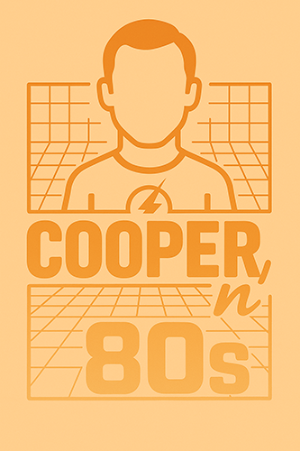

# Cooper'n'80s Kubernetes Homelab

<p align="center">
  
</p>

> *"In theory, theory and practice are the same. In practice, they are not."* - Attributed to Einstein (and every homelab builder ever)

## 🚀 Current Status

```
🖨️ 3D Printing    ████████░░ 🟡 Active     (Base rack printing)
🔧 Hardware       ██░░░░░░░░ 🔴 Planning   (Sourcing components)  
💾 Proxmox        ░░░░░░░░░░ ⚪ Waiting    (Hardware dependent)
🌐 Networking     ░░░░░░░░░░ ⚪ Waiting    (Proxmox dependent)
🚀 Kubernetes     ░░░░░░░░░░ ⚪ Waiting    (Infrastructure dependent)
🔒 Security       ░░░░░░░░░░ ⚪ Waiting    (Base platform dependent)
```

## 📚 Navigation

| Section | Description | Key Documents |
|---------|-------------|---------------|
| **🎯 [About](docs/about/)** | Project vision and background | [Project Vision](docs/about/project-vision.md) |
| **🔧 [Hardware](docs/hardware/)** | Physical components and assembly | [3D Printed Rack](docs/hardware/3d-printed-rack.md) • [Components Specs](docs/hardware/rack-components.md) • [Mini PC Selection](docs/hardware/mini-pc-selection.md) • [Shopping List](docs/hardware/shopping-list.md) |
| **📸 [Photos](docs/photos/)** | Visual build progress | [Progress Timeline](docs/photos/README.md) |
| **📖 [Learning](docs/learning/)** | Tools, workflow, and technology learning | [Technology Learning](docs/learning/technology_learning.md) • [Toolset Evolution](docs/learning/toolset-evolution.md) • [AI Workflow](docs/learning/claude-workflow.md) • [Lessons Learned](docs/learning/lessons-learned.md) |
| **🏗️ [Infrastructure](docs/infrastructure/)** | Proxmox, networking, and automation | *Coming soon* |
| **🚀 [Kubernetes](docs/kubernetes/)** | Container orchestration and services | *Coming soon* |

## 🎯 Project Overview

Enterprise-grade Kubernetes homelab for hands-on learning with enterprise technologies. Built by an Enterprise Architect to bridge the gap between architecture theory and operational reality.

> 🤓 *"If I'm going to have a lab, it's going to be theoretically and practically perfect."*

**Core Components:**
- Self-printed 10-inch rack with 3 mini PC nodes
- Proxmox virtualization with Kubernetes VMs  
- Full automation (Terraform, Ansible, GitOps)
- Enterprise security (encryption, secrets management)
- AI-assisted development workflow

**Learning Focus:** Infrastructure as Code, container orchestration, network automation, and modern DevOps practices.

## 🧪 Learning Approach

This is fundamentally a **learning project**. I'm using this repository to:

- Document my thought process and decision-making
- Track what works and what doesn't
- Build knowledge step by step
- Create a reference for future me
- Share discoveries with the community

**Scientific Method Applied:**
1. **Hypothesis** - What I think will work
2. **Experiment** - Implementation and testing  
3. **Observation** - What actually happened
4. **Documentation** - Lessons learned for next iteration

> 🔬 *"The best thing about being a scientist is that you get to be wrong professionally."*

## 🤝 Contributing

This is my personal learning journey, but if you:
- Spot errors in my approach
- Have suggestions for improvements  
- Want to share your own experiences
- Found this documentation helpful

Please feel free to open issues or discussions!

## 📄 License

Documentation: MIT License  
3D Models: Creative Commons Attribution-ShareAlike 4.0

## 🛠️ Created With

<p align="center">
  
  
  
  
</p>

*In the spirit of the classic "Created with a Mac" - because some things never go out of style.*

---

*"Bazinga! Now let's see if this actually works in practice."*

**Current Version**: v0.1.0 (Just Getting Started)