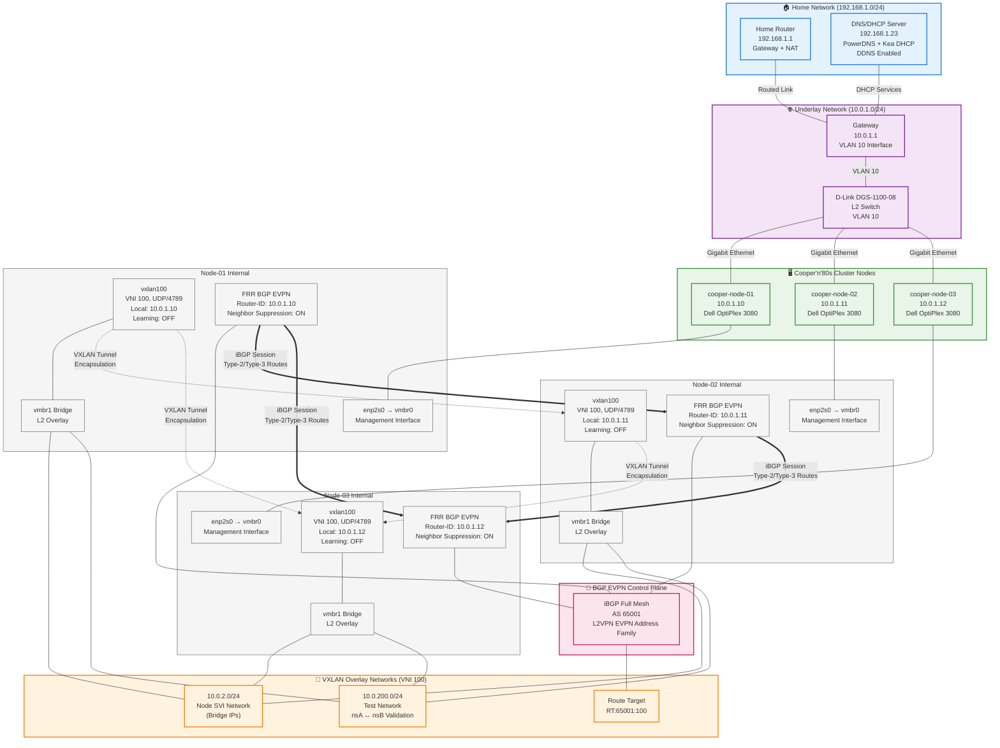

# Network Topology & Architecture

> Physical and logical network design for Cooper'n'80s Kubernetes lab



## Network Architecture Summary

### Control Plane vs Data Plane Separation
- **Control Plane**: BGP EVPN (AS 65001) handles MAC/IP learning and distribution
- **Data Plane**: VXLAN tunnels (VNI 100, UDP/4789) carry actual overlay traffic

### Key Design Principles
- **Underlay**: Traditional L3 routed network (10.0.1.0/24) provides reachability between VTEPs
- **Overlay**: VXLAN provides L2 extension across L3 boundaries with intelligent control plane
- **Route Types**: Type-2 (MAC/IP), Type-3 (IMET) for optimized forwarding and BUM handling
- **Learning**: Traditional bridge learning disabled, replaced by BGP EVPN advertisements

### Operational Benefits  
- **Scalability**: BGP EVPN eliminates flooding limitations of traditional L2
- **Multi-tenancy**: VNI segmentation enables multiple overlay networks
- **Intelligence**: Control plane provides optimal forwarding decisions
- **Enterprise Integration**: Standards-based protocols (BGP, VXLAN) for production deployment

## 🎯 Design Philosophy

**Layer Separation**: Clean separation between physical L2 switching, logical L3 routing, and overlay networking for containers and VMs.

**Leverage Existing Infrastructure**: Use home router for VLAN and routing, lab switch for efficient L2 connectivity, overlay networks for advanced features.

**Enterprise Patterns at Lab Scale**: VLAN segmentation, proper addressing, and automation-friendly configuration.

## 🌐 Network Architecture Stack

### Layer Overview
```
┌─────────────────────────────────────────────────┐
│                Application Layer                │
│         Kubernetes Services & Ingress           │
├─────────────────────────────────────────────────┤
│             Container Network (CNI)              │
│          Calico/Flannel VXLAN Overlay          │
│               Pod Network: 172.16.0.0/16       │
├─────────────────────────────────────────────────┤
│            Virtualization Layer                 │
│              VXLAN/EVPN for VM Networks         │
│            VM Networks: 10.0.2.0/24+           │
├─────────────────────────────────────────────────┤
│              Physical Network (L2/L3)           │
│          Management: 10.0.1.0/24 (VLAN 10)     │
│                 D-Link Switch L2                │
├─────────────────────────────────────────────────┤
│                Physical Hardware                │
│         3x Mini PCs + Switch + Cables          │
└─────────────────────────────────────────────────┘
```

## 📡 Physical Network Topology

### Standard Home Lab Configuration

```
                        INTERNET
                            │
                    ┌───────┴───────────────┐
                    │  Fritz!Box Router     │
                    │  192.168.1.1          │
                    │  Gateway/NAT/Firewall │
                    └───────┬───────────────┘
                            │ Native Network
                            │ 192.168.1.0/24
                            │
                    ┌───────▼───────────────┐
                    │  D-Link DGS-1210      │
                    │  (Home Core Switch)   │
                    │                       │
                    │  Services:            │
                    │  • Pi-hole DHCP/DNS  │
                    │    192.168.1.99       │
                    │  • Home devices       │
                    │  • VLAN 10 routing    │
                    │                       │
                    │  Port 18: VLAN 10     │
                    │  Untagged             │
                    └───────┬───────────────┘
                            │ Untagged VLAN 10
                            │ 10.0.1.0/24
                            │
                    ┌───────▼───────┐
              Port 1│               │Port 8
         Uplink────►│  D-Link       │◄──── Management/Laptop
         VLAN 10    │  DGS-1100-08  │       10.0.1.100
         Untagged   │  10.0.1.2     │       (DHCP/Static)
                    │               │
                    │ L2 Switch     │
                    └─┬──┬──┬──┬──┬─┘
                      │  │  │  │  │
                 Port 2  3  4  5  6-7-8
                      │     │  │  │
              Admin───┘     │  │  │  Reserve
                           ▼  ▼  ▼
          ┌─────────┐ ┌─────────┐ ┌─────────┐
          │Proxmox 1│ │Proxmox 2│ │Proxmox 3│
          │Node     │ │Node     │ │Node     │
          │10.0.1.10│ │10.0.1.11│ │10.0.1.12│
          │         │ │         │ │         │
          │ K3s VM  │ │ K3s VM  │ │ K3s VM  │
          │ Control │ │ Worker  │ │ Worker  │
          └─────────┘ └─────────┘ └─────────┘
           Mini PC 1   Mini PC 2   Mini PC 3
```

| Port | Device | IP Address | Configuration | Purpose |
|------|--------|------------|---------------|---------|
| 1 | Mini PC Node 1 | 10.0.1.10 | Untagged VLAN 10 | Control+Worker node |
| 2 | Mini PC Node 2 | 10.0.1.11 | Untagged VLAN 10 | Worker node |
| 3 | Mini PC Node 3 | 10.0.1.12 | Untagged VLAN 10 | Worker node |
| 4 | Reserved | DHCP | Untagged VLAN 10 | Future expansion |
| 5 | Reserved | DHCP | Untagged VLAN 10 | Future expansion |
| 6 | Reserved | DHCP | Untagged VLAN 10 | Future expansion |
| 7 | Reserved | DHCP | Untagged VLAN 10 | Future expansion |
| 8 | Uplink | - | Untagged VLAN 10 | Connection to home network |

## 🏠 Home Network Integration

### VLAN Strategy
**Native VLAN** (192.168.1.0/24): Home network, existing devices  
**VLAN 10** (10.0.1.0/24): Kubernetes lab, isolated but routed  

**Benefits**:
- Clean separation between home and lab traffic
- Controlled inter-VLAN routing (lab → Internet ✅, lab → Home ❌)
- Existing Pi-hole DNS integration
- Future expansion flexibility

### Router Configuration
```bash
Fritz!Box / Home Router:
├── Native VLAN: 192.168.1.0/24 (existing)
├── VLAN 10: 10.0.1.0/24 (lab network)
├── DHCP Server: 10.0.1.10-200 for VLAN 10
├── Gateway: 10.0.1.1 for VLAN 10
└── Firewall: Lab → Internet ✅, Lab ↔ Home ❌
```
## 🔗 Overlay Network Architecture (VXLAN/EVPN)

### VXLAN + EVPN Implementation
**Status**: ✅ **OPERATIONAL** - BGP EVPN control plane with VXLAN data plane

```
                        BGP EVPN Control Plane (AS 65001)
                           iBGP Full-Mesh Sessions
                     
           10.0.1.10 ◄──────────────────────────────────► 10.0.1.12
         (router-id)                                     (router-id)
     cooper-node-01                                  cooper-node-03
             │                                               │
             │                                               │
             └──────────────► 10.0.1.11 ◄────────────────────┘
                          (router-id)
                        cooper-node-02

                          VXLAN Data Plane (VNI 100)
                           UDP/4789 + vmbr1 Bridge
```

### Layer Overview (Updated with VXLAN/EVPN)
```
┌─────────────────────────────────────────────────┐
│                Application Layer                │
│         Kubernetes Services & Ingress           │
├─────────────────────────────────────────────────┤
│             Container Network (CNI)              │
│          Calico/Flannel VXLAN Overlay          │
│               Pod Network: 172.16.0.0/16       │
├─────────────────────────────────────────────────┤
│            Virtualization Layer (NEW)           │
│         🟢 VXLAN/EVPN Overlay Operational       │
│              VNI 100 + BGP EVPN AS 65001       │
│              VM Networks: 10.0.200.0/24+       │
│              Test Networks: 10.0.200.0/24      │
├─────────────────────────────────────────────────┤
│              Physical Network (L2/L3)           │
│          Management: 10.0.1.0/24 (VLAN 10)     │
│                 D-Link Switch L2                │
├─────────────────────────────────────────────────┤
│                Physical Hardware                │
│         3x Mini PCs + Switch + Cables          │
└─────────────────────────────────────────────────┘
```

### VXLAN Configuration Details

#### Per-Node VXLAN Interface
```bash
# /etc/network/interfaces.d/evpn.cfg
auto vxlan100
iface vxlan100 inet manual
  vxlan-id 100
  vxlan-local-tunnelip <node-specific-ip>  # 10.0.1.10/11/12
  vxlan-udp-port 4789
  bridge-learning off
  bridge-arp-nd-suppress on

auto vmbr1
iface vmbr1 inet manual
  bridge_ports vxlan100
  bridge_stp off
  bridge_fd 0
```

#### BGP EVPN Configuration (FRR)
```bash
# Per-node FRR configuration
router bgp 65001
 bgp router-id <node-underlay-ip>
 no bgp default ipv4-unicast
 neighbor 10.0.1.10 remote-as 65001  # cooper-node-01
 neighbor 10.0.1.11 remote-as 65001  # cooper-node-02
 neighbor 10.0.1.12 remote-as 65001  # cooper-node-03
 
 address-family l2vpn evpn
  neighbor 10.0.1.10 activate
  neighbor 10.0.1.11 activate  
  neighbor 10.0.1.12 activate
  advertise-all-vni
 exit-address-family
```

### Overlay Network Addressing

**VXLAN Networks** (Overlay L2 segments on vmbr1):
- **VNI 100**: Primary overlay network for VM interconnection
- **Test Network**: 10.0.200.0/24 (validated with namespace testing)
- **VM Networks**: 10.0.2.0/24+ (planned for K3s VM deployment)
- **Route Targets**: RT:65001:100 for VNI 100

**Control Plane Operations**:
- **Type-3 Routes**: IMET (Inclusive Multicast Ethernet Tag) for BUM traffic
- **Type-2 Routes**: MAC/IP advertisements for unicast forwarding
- **VTEPs**: 10.0.1.10, 10.0.1.11, 10.0.1.12 (underlay addresses)

### Validation Results

#### BGP Session Status
```bash
# All three nodes show Established sessions
cooper-node-01# show bgp summary
Neighbor     V AS MsgRcvd MsgSent   Up/Down State
10.0.1.11    4 65001    45      44  00:42:15     0
10.0.1.12    4 65001    43      42  00:42:12     0
```

#### EVPN Route Exchange
```bash
# Type-3 IMET routes operational
cooper-node-01# show bgp l2vpn evpn route type 3
*> [3]:[0]:[32]:[10.0.1.10]
*  [3]:[0]:[32]:[10.0.1.11] via 10.0.1.11
*  [3]:[0]:[32]:[10.0.1.12] via 10.0.1.12
```

#### L2 Connectivity Validation
```bash
# Cross-node ping successful (nsA on node-01 → nsB on node-03)
# Network: 10.0.200.1/24 ↔ 10.0.200.2/24 via VXLAN VNI 100
ip netns exec nsA ping 10.0.200.2
PING 10.0.200.2 (10.0.200.2) 56(84) bytes of data.
64 bytes from 10.0.200.2: icmp_seq=1 ttl=64 time=0.420 ms
```

### Integration with Existing Architecture

**Physical Network**: VXLAN tunnels use existing 10.0.1.0/24 underlay  
**Proxmox Integration**: vmbr1 bridge ready for VM attachment  
**Future K3s**: VMs will connect via vmbr1 with overlay networking  
**Scalability**: EVPN supports multiple VNIs and tenant separation

### Benefits for K3s Deployment

**Multi-Tenancy**: Different VNIs for different applications/environments  
**Scalability**: EVPN supports large-scale VM deployments  
**Performance**: Hardware VTEP acceleration where available  
**Operational**: Centralized control plane with distributed data plane  
**Integration**: Works seamlessly with CNI overlay networks in Kubernetes

### Monitoring & Troubleshooting

#### Key Validation Commands
```bash
# BGP session health
vtysh -c "show bgp l2vpn evpn summary"

# EVPN route tables  
vtysh -c "show bgp l2vpn evpn route type 2"  # MAC/IP
vtysh -c "show bgp l2vpn evpn route type 3"  # IMET

# VXLAN interface status
ip -d link show dev vxlan100
bridge fdb show | grep vxlan100
```

#### Performance Characteristics
- **Encryption**: Not enabled at VXLAN layer (handled by ZFS for storage)
- **MTU**: Standard 1500 bytes (no fragmentation issues observed)
- **Latency**: Sub-millisecond overlay forwarding
- **Throughput**: Full underlay bandwidth available (1Gbps)

---

**VXLAN/EVPN Status**: 🟢 **Production Ready** - BGP EVPN control plane operational with validated L2 connectivity across all three nodes.

## 📍 IP Address Allocation

### Management Network (10.0.1.0/24)

| Range | Purpose | Assignment Method |
|-------|---------|------------------|
| 10.0.1.1 | VLAN Gateway | Static (router) |
| 10.0.1.2 | Switch Management | Static |
| 10.0.1.10-12 | Mini PC Nodes | DHCP Reservation |
| 10.0.1.20-29 | Future Nodes | Reserved |
| 10.0.1.30-49 | Load Balancer IPs | Reserved |
| 10.0.1.50-99 | Infrastructure Services | Reserved |
| 10.0.1.100 | Admin Laptop | Static/DHCP Reservation |
| 10.0.1.101-200 | DHCP Pool | Dynamic Assignment |

### Virtual Networks

**VM Networks** (Proxmox/KubeVirt):
- 10.0.2.0/24: Control plane VMs
- 10.0.3.0/24: Worker VMs
- 10.0.4.0/24: Storage/Infrastructure VMs

**Container Networks** (CNI):
- 172.16.0.0/16: Pod network (VXLAN overlay)
- 192.168.0.0/16: Kubernetes services
- 10.96.0.0/12: Cluster IP services (K3s default)

## 🚀 Portable Configuration (Optional)

### Mobile Lab Setup with RPi Gateway

```
                    EXTERNAL NETWORK
                    (Hotel/Office/etc)
                            │
                            │ DHCP Client
                            │
                    ┌───────▼───────┐
                    │  Raspberry Pi │ eth0: External DHCP
                    │  Gateway      │ eth1: 10.0.1.1/24
                    │               │
                    │  NAT/Firewall │
                    └───────┬───────┘
                            │ 10.0.1.0/24
                            │ (Lab Network)
                            │
                    ┌───────▼───────┐
              Port 1│               │Port 8
           From RPi─►│  D-Link       │◄──── Management
           10.0.1.1  │  DGS-1100-08  │       10.0.1.100
                    │  10.0.1.2     │
                    │               │
                    └─┬──┬──┬──┬──┬─┘
                      │  │  │  │  │
                      ▼  ▼  ▼  ▼  ▼
                   K8s Nodes (unchanged)
```

### RPi Gateway Services
- **NAT/Masquerade**: eth0 (external) ↔ eth1 (internal)
- **DHCP Server**: 10.0.1.10-200 for lab nodes
- **DNS Forwarding**: External DNS resolution
- **Optional VPN**: Remote access to lab

## 🌐 Network Services (NEW - Implemented)

### DNS Infrastructure
**Cooper DNS Stack**: Deployed at 192.168.1.23
- **Authoritative DNS**: PowerDNS serving cooper.lab domain
- **Recursive DNS**: Full resolution with upstream forwarding to Pi-hole
- **Dynamic DNS**: Automatic record creation from DHCP leases
- **Web Management**: PowerDNS Admin interface

### DHCP Services
**Enterprise DHCP**: Kea DHCP4 with DDNS integration
- **IP Pool**: 10.0.1.100-200 (100 addresses available)
- **Gateway**: 10.0.1.1 (existing router VLAN interface)
- **DNS**: 192.168.1.23 (Cooper DNS stack)
- **Domain**: cooper.lab (automatic registration)

### Service Discovery
**cooper.lab Domain**: All lab devices automatically registered
- **A Records**: hostname.cooper.lab → IP address
- **PTR Records**: IP address → hostname.cooper.lab  
- **SOA Authority**: PowerDNS authoritative server
- **Upstream**: External queries forwarded to Pi-hole (192.168.1.99)

### Network Flow
```
Lab Device DHCP Request (10.0.1.0/24)
        ↓ DHCP Relay
Router forwards to 192.168.1.23
        ↓ IP Assignment
Kea DHCP assigns from pool 10.0.1.100-200
        ↓ DDNS Update
Automatic DNS record creation in cooper.lab
        ↓ Service Discovery
Device accessible via hostname.cooper.lab
```

## 🔄 Traffic Flow Examples

### Pod-to-Pod Communication (Cross-Node)
```
Pod A (172.16.1.10) on Node 1
        ↓ CNI Routing
Node 1 (10.0.1.10) VXLAN encapsulation
        ↓ Physical Network
D-Link Switch (L2 forwarding)
        ↓ Physical Network  
Node 2 (10.0.1.11) VXLAN decapsulation
        ↓ CNI Routing
Pod B (172.16.2.20) on Node 2
```

### External Service Access
```
Internet Request
    ↓ Router NAT
VLAN 10 (10.0.1.0/24)
    ↓ L2 Switch
Node with Ingress Controller
    ↓ K8s Service Mesh
Target Pod
```

### Management Access
```
Admin Laptop (10.0.1.100)
    ↓ Same L2 network
Node Management (10.0.1.10-12)
    ↓ SSH/API
VM/Container workloads
```

## 🛠️ Configuration Examples

### D-Link Switch Setup
```bash
# Web interface: http://10.0.1.2
# Configuration:
- All ports: Untagged members of VLAN 10
- PVID: 10 for all ports
- Management VLAN: 10
- SSH: Enabled for automation
```

### RPi Gateway (Portable Mode)
```bash
# /etc/netplan/01-netcfg.yaml
network:
  version: 2
  ethernets:
    eth0:
      dhcp4: true
    eth1:
      addresses: [10.0.1.1/24]

# NAT rules
iptables -t nat -A POSTROUTING -o eth0 -j MASQUERADE
iptables -A FORWARD -i eth1 -o eth0 -j ACCEPT
```

## 🔧 Cable Management & Physical Layout

### Rack Wiring (8U)
```
╔══════════════════════════════╗
║ 8U │ 🔌 Patch Panel          ║ ← Keystone modules
║    │ 📦 Cover/Free          ║ ← Upper half expansion
╠══════════════════════════════╣
║ 7U │ 🌐 D-Link Switch        ║ ← [1][2][3][4][5][6][7][8]
╠══════════════════════════════╣
║ 6U │ 📦 Cover/Free          ║ ← Future expansion
╠══════════════════════════════╣
║ 5U │ 🖥️ Mini PC Node #3      ║ ── 0.5m orange cable
╠══════════════════════════════╣
║ 4U │ 🖥️ Mini PC Node #2      ║ ── 0.5m orange cable  
╠══════════════════════════════╣
║ 3U │ 🖥️ Mini PC Node #1      ║ ── 0.25m orange cable
╠══════════════════════════════╣
║ 2U │ 📦 Cover/Free          ║ ← Cable management
╠══════════════════════════════╣
║ 1U │ ⚡ Power Supply Tray    ║ ← Mini PC power organization
╚══════════════════════════════╝
```

### Cable Specifications
- **Node connections**: 0.25-0.5m orange patch cables (Nodes → Switch)
- **Uplink**: 1-2m cable to home network (DGS-1210 Port 18)
- **Management**: Admin laptop connects via available switch ports
- **Total**: 20x cables ordered (10x 0.25m, 10x 0.5m) - sufficient coverage

## 🎯 Design Benefits

### Operational Advantages
- **Simple L2 switching**: No complex VLAN tagging in lab switch
- **Leveraged infrastructure**: Uses existing home router capabilities
- **Clean separation**: Lab traffic isolated but internet-accessible
- **Future expansion**: Easy to add VLANs or additional switches

### Learning Value
- **Enterprise patterns**: VLAN segmentation, proper addressing
- **Overlay networking**: VXLAN, service mesh, CNI implementations
- **Multi-layer troubleshooting**: Physical, virtual, and container networks
- **Automation-friendly**: SSH access to switch, consistent addressing

### Cost Efficiency
- **Used existing assets**: Home router already VLAN-capable
- **Future-proof**: Design supports both architectural paths

## 📚 Related Documentation

- **[Networking Hardware](../03-hardware/components/networking.md)** - Physical components
- **[Kubernetes Strategy](kubernetes-strategy.md)** - How networking supports both paths
- **[Implementation](../04-implementation/)** - Configuration details and automation

---

**Network Philosophy**: *"A well-planned topology is half the battle won. The other half is good cable management and clear documentation."*