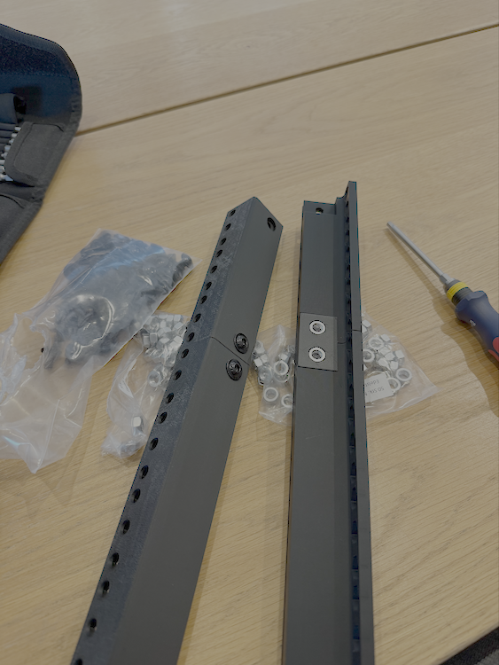
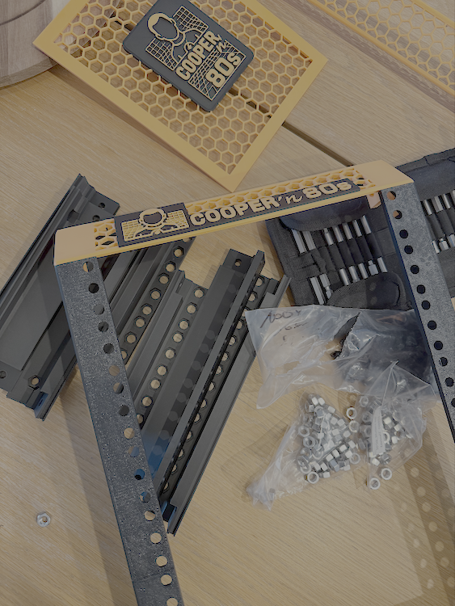
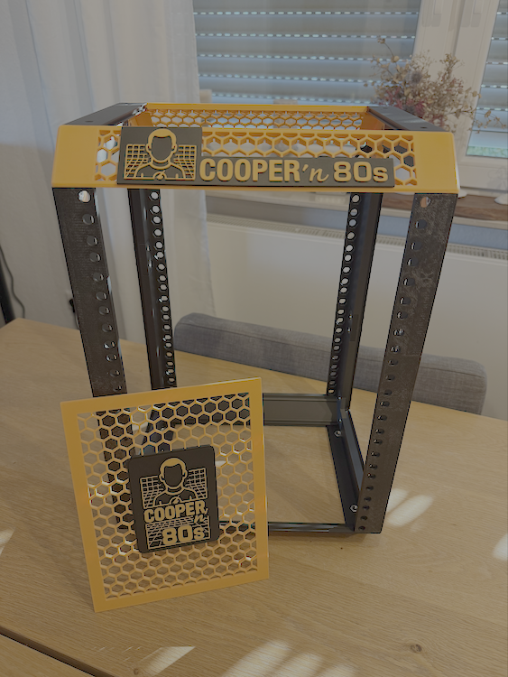

# 3D Printing Assembly Process

> Detailed build procedures and progress for Cooper'n'80s rack fabrication

## 🖨️ Printer Setup

**Printer**: Bambu Lab P1S  
**Slicer**: Bambu Studio  
**Settings**: Optimized for structural and functional components

### Print Parameters
- **Layer Height**: 0.2mm (balance of speed and quality)
- **Infill**: 15% (optimal strength-to-material ratio)
- **Walls**: 2 perimeters (adequate for structural loads)
- **Support**: Minimal, design-optimized geometries

## 📋 Print Queue & Status

### Phase 1: Base Frame ✅ COMPLETED

| Component | Material | Weight | Status | Notes |
|-----------|----------|--------|--------|-------|
| Base Posts (4x) | Black PLA Matte | 281.69g | ✅ | Frame foundation |
| Side Joiners (4x) | Black PLA Matte | ~150g | ✅ | Structural connections |
| Extension Posts (4x) | Black PLA Matte | ~200g | ✅ | Height extensions |
| Extension Connectors (4x) | Black PLA Matte | ~90g | ✅ | Post connections |

**Phase 1 Total**: 722.26g Black PLA Matte (€10.11)

### Phase 2: Frame Completion ✅ COMPLETED

| Component | Material | Weight | Status | Notes |
|-----------|----------|--------|--------|-------|
| Horizontal Joiners - Solid (2x) | Black PLA Matte | ~80g | ✅ | Structural rails installed |
| Horizontal Joiners - Grid (2x) | Orange PLA Matte | ~80g | ✅ | Ventilation + accent completed |
| Handles (2x) | Orange PLA Matte | ~30g | ⚪ | Deferred - access priority |
| Feet (2x) | Orange PLA Matte | ~20g | ⚪ | Pending smaller-head screws |

### Phase 3: Assembly Complete ✅ MILESTONE ACHIEVED

**August 19, 2025 - Physical Assembly Completed**

  

*Assembly progression: M6 flanged bolts and components (left), frame construction with branding (center), completed 8U professional rack structure (right)*

#### Engineering Discoveries
- **✅ Flanged Screw Advantage**: M6 flanged bolts sit on surface rather than recessed - provides superior aesthetic finish
- **🔧 Design Adaptation**: Top/bottom panels temporarily omitted for better equipment access during integration phase
- **📏 Hardware Reality**: Flanged design eliminates potential stress concentration from recessed mounting
- **⚠️ Foot Mounting Issue**: Standard flanged bolts incompatible with foot design - requires 4x smaller-head screws

### Phase 3: Custom Elements ⚪ PENDING

| Component | Material | Weight | Status | Notes |
|-----------|----------|--------|--------|-------|
| Cooper'n'80s Logo | Orange/Black PLA | ~15g | ⚪ | Top rail branding |
| Side Panels 5U (2x) | Black/Orange PLA | ~100g | ⚪ | Ventilation + logo |
| Side Panels 1.5U (4x) | Black/Orange PLA | ~80g | ⚪ | Additional ventilation |
| Logo Strips (2x) | Orange/Black PLA | ~20g | ⚪ | Exterior branding |

### Phase 4: Functional Components ⚪ PENDING

| Component | Material | Weight | Status | Notes |
|-----------|----------|--------|--------|-------|
| Mini PC Mounts (3x) | Black PETG | ~90g | ⚪ | Heat-resistant mounting |
| Switch Mount | Black PETG | ~30g | ⚪ | Equipment bracket |
| Patch Panel Frame | Black PLA Matte | ~50g | ⚪ | Keystone housing |
| Front Covers 1U (2x) | Black PLA Matte | ~60g | ⚪ | Power floor concealment |
| Front Covers 2U (2x) | Black PLA Matte | ~80g | ⚪ | Cable management concealment |
| PDU Floor Insert | Black PLA Matte | ~100g | ⚪ | 3x PSU organization |

## 🎨 Material Strategy

### PLA Matte (Structural - Black)
**Components**: Frame posts, panels, non-heat elements  
**Properties**: 
- Easier printing, sufficient strength for static loads
- Matte finish reduces layer line visibility
- Professional aesthetic consistency

### PLA Matte (Accent - Orange)
**Components**: Handles, grid panels, branding elements  
**Purpose**: Cooper'n'80s brand identity and functional highlights  
**Placement**: Strategic visibility points for brand recognition

### PETG (Functional - Black)
**Components**: Mini PC mounts, switch brackets, heat-sensitive parts  
**Properties**:
- Superior heat resistance near electronics
- Better impact resistance for removable components
- Consistency with frame color scheme

## 🔧 Print Sequence Strategy

### 1. Foundation First ✅
**Completed**: Base frame ensures critical path progress  
**Validation**: Test assembly with actual M6 hardware  
**Learning**: Confirm dimensional accuracy before proceeding

### 2. Complete Structure 🟡
**Current**: Horizontal joiners and basic frame completion  
**Goal**: Fully assembled 8U frame ready for equipment  
**Test**: Verify stability and mounting point alignment

### 3. Custom Branding ⚪
**Next**: Side panels with integrated ventilation and logos  
**Files**: Custom STLs designed in Tinkercad, colored in Bambu Studio  
**Quality**: Focus on clean color separation and finish

### 4. Functional Integration ⚪
**Final**: Equipment mounting brackets and cable management  
**Material**: PETG for heat resistance near electronics  
**Fit**: Test with actual hardware before final prints

## 📐 Quality Control

### Dimensional Verification
```
✅ M6 bolt holes: Proper fit confirmed with test hardware
✅ Post alignment: Frame squares properly  
✅ Equipment spacing: 1U spacing verified
⏳ Custom elements: Pending test assembly
```

### Print Quality Standards
- **Layer adhesion**: No delamination on structural components
- **Dimensional accuracy**: ±0.2mm tolerance for mounting holes
- **Surface finish**: Matte texture consistent across components
- **Color consistency**: Orange accents match between prints

## 🛠️ Assembly Process

### Tools Required
- M6 hex key (for flanged bolts)
- Digital calipers (dimensional verification)
- Small hammer (gentle persuasion for tight fits)
- Cable ties (temporary alignment during assembly)

### Assembly Sequence
1. **Base frame assembly** - Posts and side joiners
2. **Extension connection** - Add 3U height extension
3. **Horizontal rails** - Complete structural frame
4. **Equipment test fit** - Verify component mounting
5. **Custom element installation** - Branding and aesthetics
6. **Final integration** - Equipment mounting and cables

## 📊 Material Usage Tracking

### Filament Consumption

**Used (Completed)**:
- Black PLA Matte: 722.26g (€10.11)

**Estimated Remaining**:
- Black PLA Matte: ~250g (€3.50) - Structure completion
- Orange PLA Matte: ~200g (€2.80) - Accent elements
- Black PETG: ~120g (€2.00) - Functional components

**Total Project Estimate**: ~1,292g mixed materials (~€18.41)


## 🎯 Current Status

### Progress Overview
```
📦 Base Frame      ████████████ ✅ Completed and assembled
🔧 Extensions      ████████████ ✅ Installed and functional  
🎨 Custom Elements ████████████ ✅ Branding integration complete
⚙️ Functional      ██████░░░░░░ 🟡 Equipment mounting brackets pending
```

### Assembly Achievements
- ✅ **Complete 8U Frame Structure** - Professional rack-mount appearance
- ✅ **Cooper'n'80s Branding** - Integrated orange hex-pattern panels with logo
- ✅ **Structural Integrity** - Solid, stable, ready for equipment mounting
- ✅ **Engineering Adaptation** - Flanged screw optimization discovered and implemented

### Next Phase: Equipment Integration
1. **Print Equipment Brackets** - D-Link switch mounting, patch panel frame
2. **Resolve Foot Hardware** - Source 4x smaller-head screws for proper foot mounting
3. **Power Distribution** - Design floor/mounting for Mini PC power supplies
4. **Cable Management** - Integrated routing and organization system

## 🔍 Lessons Learned

### Print Settings Optimization
- **Infill**: 15% sufficient for non-load-bearing components
- **Layer height**: 0.2mm optimal for speed vs quality
- **Support**: Design eliminates most support requirements

### Material Choices
- **PLA Matte**: Excellent for structural components, professional finish
- **Color changes**: Bambu Studio dual-color works well for branding
- **PETG planning**: Will validate heat resistance claims with electronics

### Design Validation
- **mklements design**: Proven engineering translates perfectly to Bambu P1S
- **Dimensional accuracy**: Excellent fit with standard M6 hardware
- **Modular approach**: Easy to print and assemble in phases

## 📚 Related Documentation

- **[Rack Components](../components/rack.md)** - Complete component specifications
- **[Hardware Overview](../README.md)** - Integration with other systems
- **[Progress Photos](../../photos/)** - Visual build documentation

---

**Current Focus**: Complete structural frame → Begin custom branding elements → Prepare for equipment integration

*"The best thing about 3D printing is that you get to be wrong quickly and cheaply, then iterate to perfection."*