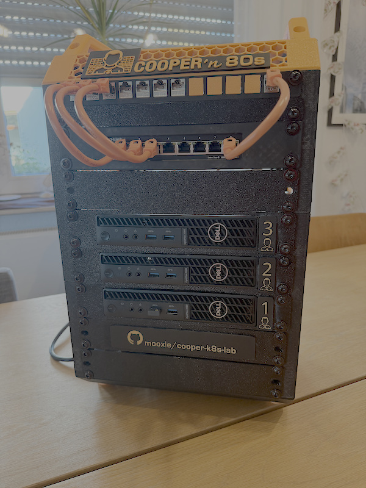
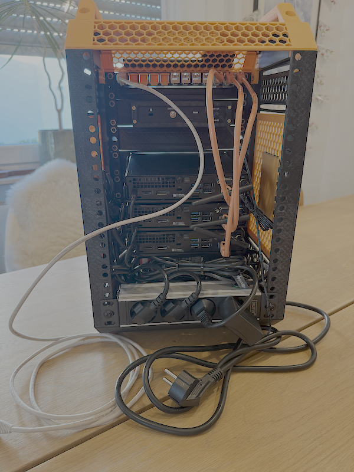

# Build Progress Photos

> Visual documentation of Cooper'n'80s assembly process

## 📸 Photo Documentation

Visual progress tracking for the hardware build, organized by assembly phase and component.

## 🖨️ 3D Printing Progress

### August 17, 2025 - Print Start

| Image | Description |
|-------|-------------|
|  | Base frame components on print plate - Posts and joiners ready for printing |
|  | Active printing in progress - Bambu P1S working on base posts |
|  | Cooper'n'80s logo 3D print preview - Orange and black color scheme |

### August 19, 2025 - Assembly Complete

| Image | Description |
|-------|-------------|
|  | **M6 flanged bolts and frame components** - Precision-engineered posts with mounting hardware ready for assembly |
|  | **Frame construction with Cooper'n'80s branding** - Integration of custom hex-pattern panels during assembly process |
|  | **Finished 8U professional rack** - Complete structure showcasing integrated branding and professional rack-mount aesthetics |

### August 25, 2025 - Complete Infrastructure Integration

| Image | Description |
|-------|-------------|
|  | **Complete Cooper'n'80s infrastructure platform** - Three Dell OptiPlex 3080 Micro nodes with integrated D-Link networking, professional orange branding, and enterprise-grade cable management |
|  | **Rear infrastructure view** - Organized power distribution, network uplinks, and systematic cable routing ready for production deployment |

### Final Integration Achievements
- ✅ **All Hardware Integrated** - 3x Dell OptiPlex Mini PCs mounted and operational
- ✅ **Network Infrastructure** - D-Link switch with orange patch cables and professional routing
- ✅ **Power Management** - Individual PSUs organized with rear PDU distribution  
- ✅ **Professional Aesthetics** - Cooper'n'80s branding with enterprise-grade finish
- ✅ **Production Ready** - Complete infrastructure platform ready for Proxmox deployment

### Integration Milestones
- **Physical Assembly** → **COMPLETE**: Professional 8U rack with all components
- **Network Integration** → **OPERATIONAL**: Switch, patch panel, and cable management  
- **Hardware Deployment** → **ACHIEVED**: All 3 Mini PCs installed and connected
- **Infrastructure Platform** → **READY**: Prepared for automated Proxmox installation

### Assembly Milestones
- ✅ **Frame Assembly** - Complete 8U structure successfully assembled
- ✅ **Engineering Discovery** - Flanged screw surface mounting provides superior finish
- ✅ **Branding Integration** - Cooper'n'80s elements perfectly integrated
- ✅ **Professional Appearance** - Enterprise-grade rack aesthetics achieved

### Print Status: Base Frame
- ✅ **Base Posts** - 4x posts completed successfully
- ✅ **Side Joiners** - 4x joiners printed and tested
- ✅ **Extension Posts** - 4x extension posts completed
- ✅ **Extension Connectors** - 4x connectors printed
- ✅ **Branding Elements** - Cooper'n'80s strips completed
- 🟡 **Assembly Hardware** - M6 bolts arriving tomorrow
- ⚪ **Horizontal Elements** - Grid joiners and handles pending

## 🔧 Assembly Progress

### Frame Assembly
- ⚪ **Base Assembly** - Pending completion of horizontal joiners
- ⚪ **Extension Assembly** - Awaiting base completion
- ⚪ **Hardware Installation** - M6 bolts and nuts ready
- ⚪ **Fit Testing** - Component alignment verification

### Equipment Integration
- ⚪ **Mini PC Mounting** - Custom brackets to be printed
- ⚪ **Switch Installation** - Network equipment mounting
- ⚪ **Cable Management** - Routing and organization
- ⚪ **Final Assembly** - Complete system integration

## 📋 Documentation Guidelines

### Photo Standards
- **Resolution**: High quality for documentation purposes
- **Lighting**: Good lighting to show detail and progress
- **Angles**: Multiple perspectives for comprehensive documentation
- **Context**: Include scale references where helpful

### Progress Tracking
- **Before/During/After**: Document each major assembly phase
- **Problem Areas**: Capture issues and solutions
- **Quality Check**: Show fit and finish details
- **Comparison**: Progress over time comparison shots

## 🎯 Next Photo Targets

### Immediate (Next Print Session)
- [ ] Horizontal joiners print completion
- [ ] Custom side panels with logo integration
- [ ] Orange accent components (handles, feet)
- [ ] Complete frame assembly

### Assembly Phase
- [ ] First component mounting test
- [ ] Cable routing and management
- [ ] Equipment integration
- [ ] Completed rack with branding

### Final Documentation
- [ ] Professional glamour shots of completed build
- [ ] Comparison with original design renders
- [ ] Detail shots of custom elements
- [ ] Full system operational photos

## 📁 Photo Organization

```
photos/
├── 3d-printing/
│   ├── printplates_17Aug.png     ✅ Base frame print plates
│   ├── print_live_17Aug.png      ✅ Active printing process
│   ├── logo_3dprint_preview.png  ✅ Logo 3D preview
│   └── [future printing photos]
├── assembly/
│   └── [assembly process photos]
├── equipment/
│   └── [component integration photos]
└── final/
    └── [completed build photos]
```

## 🔗 Related Documentation

- **[3D Printing Process](../3d-printing.md)** - Technical details and progress
- **[Rack Components](../../components/rack.md)** - Component specifications
- **[Assembly Process](../)** - Complete build documentation

---

**Photo Documentation Philosophy**: *"A picture is worth a thousand words, but a well-documented build process is worth a thousand troubleshooting sessions."*