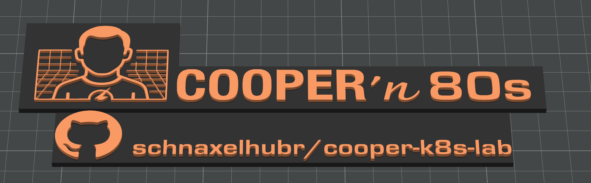

# Rack System & Enclosure

> Custom 3D-printed 8U rack based on mklements' Lab-Rax design

## 🎯 Overview

**Design**: mklements Lab-Rax 8U (5U base + 3U extension)  
**Form Factor**: 10-inch rack standard  
**Material**: PLA Matte (structure) + PETG (heat-sensitive components)  
**Branding**: Custom Cooper'n'80s elements in orange accents

> *"Standing on the shoulders of a true maker giant"* - Building on mklements' proven engineering

## 🏗️ Design Philosophy

### Why mklements' Lab-Rax System
✅ **Extensively tested** - Multiple builds across maker community  
✅ **Standard hardware** - M6 metric screws from local hardware store  
✅ **Modular expansion** - Engineered for easy scaling  
✅ **Professional grade** - Clean, rack-mount aesthetic  
✅ **Open source** - Available on GitHub and MakerWorld

### Design Principles
- **Modularity**: Standard interfaces between all components
- **Tool-Free Access**: Front panels removable without disassembly  
- **Cable Management**: Integrated routing paths and clip attachment
- **Future Expansion**: Supports additional 3U extensions
- **Professional Finish**: Enterprise aesthetics at lab scale

## 📐 Rack Configuration (8U Total)

### Equipment Layout

```
╔══════════════════════════════╗
║ 8U │ 🔌 Patch Panel (0.5U)   ║
╠══════════════════════════════╣
║ 7.5U│ 🌐 D-Link Switch       ║
╠══════════════════════════════╣
║ 6.5U│ *Future Expansion*     ║
╠══════════════════════════════╣
║ 5.5U│ *Future Expansion*     ║
╠══════════════════════════════╣
║ 4.5U│ 🖥️ Mini PC Node #3    ║
╠══════════════════════════════╣
║ 3.5U│ 🖥️ Mini PC Node #2    ║
╠══════════════════════════════╣
║ 2.5U│ 🖥️ Mini PC Node #1    ║
╠══════════════════════════════╣
║ 2U  │ 📦 Hidden Storage      ║ ← Front Cover
╠══════════════════════════════╣
║ 1U  │ ⚡ Power Floor         ║ ← Front Cover
╚══════════════════════════════╝
          PDU rear-mounted
```

### Zone Organization
- **Equipment Zone** (2.5U-8U): Visible components - Mini PCs, switch, patch panel
- **Hidden Zone** (1U-2U): Power supplies, cable management behind front covers
- **Rear Zone**: PDU power distribution and cable routing
- **Thermal Design**: Heat sources at bottom, natural convection cooling

## 🖨️ Print Specifications

### Base Components (mklements design)

| Component | Quantity | Material | Color | Status |
|-----------|----------|----------|-------|--------|
| Base Posts | 4 | PLA Matte | Black | ✅ Completed |
| Extension Posts | 4 | PLA Matte | Black | ✅ Completed |
| Side Joiners | 4 | PLA Matte | Black | ✅ Completed |
| Extension Connectors | 4 | PLA Matte | Black | ✅ Completed |
| Horizontal Joiners - Solid | 2 | PLA Matte | Black | ⚪ Pending |
| Horizontal Joiners - Grid | 2 | PLA Matte | Orange | ⚪ Pending |
| Handles | 2 | PLA Matte | Orange | ⚪ Pending |
| Feet | 2 | PLA Matte | Orange | ⚪ Pending |

### Custom Components

| Component | Quantity | Material | Color | Purpose |
|-----------|----------|----------|-------|---------|
| Cooper'n'80s Logo | 1 | PLA Matte | Orange/Black | Top rail branding |
| Cooper'n'80s Strips | 2 | PLA Matte | Orange/Black | Side panel branding |
| Custom Side Panels (5U) | 2 | PLA Matte | Black/Orange | Ventilation + branding |
| Custom Side Panels (1.5U) | 4 | PLA Matte | Black/Orange | Ventilation + branding |
| Mini PC Mounts | 3 | PETG | Black | Heat-resistant equipment mounting |

## 🎨 Custom Design Elements

### Custom Side Panel Ventilation

> *"As Sheldon Cooper would say: 'It's not just ventilation... it's an elegant equation of airflow, symmetry, and personal branding.'"*

**Design Foundation**: Building upon mklements' proven hexagon ventilation patterns

#### Source Models & Attribution

| Original Model | Author | Purpose | Link |
|----------------|--------|---------|------|
| **5U Sidepanels with Hex Pattern Ventilation** | AlanMG_3D | Ventilation inspiration | [MakerWorld](https://makerworld.com/de/models/1577920-5u-sidepanels-with-hex-pattern-ventilation?from=email_notification#profileId-1703572) |
| **5U Hexpattern Extension Panel** | AlanMG_3D | Base geometry for modifications | [MakerWorld](https://makerworld.com/de/models/1618034-5u-hexpattern-extention-panel#profileId-1708066) |

#### Cooper'n'80s Modifications

**Design Process**:
1. **Base Model**: Used AlanMG_3D's 5U hexpattern extension panel as foundation
2. **Logo Integration**: Embedded custom Cooper'n'80s logo using Tinkercad
3. **Height Adaptation**: Created additional 1.5U elements for 8U total rack height
4. **Enhanced Ventilation**: Added extra ventilation slots in 1.5U panels
5. **Color Customization**: Applied dual-color scheme in Bambu Lab Studio

**Visual Design Preview**:

| 5U Sidepanel with Logo | 1.5U Sidepanel | Logo Strips for Case |
|:----------------------:|:--------------:|:-------------------:|
|  |  |  |
| Main side panel with integrated Cooper'n'80s logo | Additional ventilation panels for 8U height | Long-format strips for exterior branding |

**Specific Changes**:
- **5U Panel**: Original hex pattern + integrated Cooper'n'80s logo cutout
- **1.5U Panels**: New design with additional ventilation for optimal airflow
- **Logo Strips**: Extended branding elements for case exterior mounting
- **Material Strategy**: Black base structure + orange accent elements
- **Functional Enhancement**: Improved thermal management through expanded ventilation area

#### Design Tools & Workflow
- **Modification Platform**: Tinkercad for logo integration and panel adaptation
- **Print Preparation**: Bambu Lab Studio for dual-color configuration
- **Quality Approach**: Maintained mklements' proven ventilation geometry while adding custom elements

#### Final Assets
- [`5U_Sidepanel_Logo.stl`](../../../assets/5U_Sidepanel_Logo.stl) - Modified with logo integration
- [`1_5U_Sidepanel.stl`](../../../assets/1_5U_Sidepanel.stl) - Custom height extension panels

**Philosophy**: Standing on the shoulders of giants (mklements) while adding precisely calculated personal touches for optimal form and function.

### Branding Elements

**Cooper'n'80s Logo**:
- Single color: Black PLA (professional, subtle)
- Dual color: Black base + Orange accent (full brand impact)
- Mounting: Top ventilation rail for prominent visibility

**Available Assets**:
- [`Cooper'n80s.stl`](../../../assets/Cooper'n80s.stl) - Single color
- [`Cooper'n80s.3mf`](../../../assets/Cooper'n80s.3mf) - Dual color  
- [`Cooper'n80s_long.3mf`](../../../assets/Cooper'n%2780s_long.3mf) - Exterior strips

## 🔧 Assembly Hardware

### Mounting Hardware
- **Bolts**: M6×12mm flanged screws (black zinc plated)
- **Nuts**: M6 hex nuts (stainless steel DIN 934)
- **Quantity**: 100 screws, 50 nuts
- **Source**: eBay (khs_2005) - €31.49

### Material Strategy
- **PLA Matte (Structural)**: Frame, panels, non-heat components
- **PETG (Functional)**: Mini PC mounts, switch brackets near electronics
- **Color Coordination**: Black primary + Orange accents for brand consistency

## 🌡️ Thermal Management

### Airflow Design
- **Ventilation**: Hex patterns in side panels for passive airflow
- **Clearance**: Minimum 15mm between components
- **Material Selection**: PETG for heat-sensitive mounting points
- **Heat Isolation**: Thermal barriers between hot components

### Component Spacing
```
Mini PC Node 1  ←→  15mm clearance  ←→  Mini PC Node 2
                ↕ 44.45mm (1U)
Switch Position ←→  20mm clearance  ←→  Patch Panel
```

## 📊 Build Progress

### Current Status (Material Used)
```
Frame Base:           722.26g Black PLA (€10.11)
Extensions:           ~200g Black PLA (estimated)
Custom Elements:      ~150g Orange PLA (estimated)
Functional Mounts:    ~100g Black PETG (estimated)
Total Estimate:       ~1172g mixed materials (~€16.50)
```

### Assembly Progress


*All printed frame components ready for assembly - Base posts, extension posts, side joiners, extension connectors, and Cooper'n'80s branding elements*

### Assembly Phases
1. **✅ Base Frame** - All structural components assembled
2. **✅ Hardware Assembly** - Frame construction completed with M6 bolts
3. **⚪ Custom Elements** - Side panels and additional branding pending
4. **⚪ Equipment Integration** - Component mounting and cable management

## 🔧 Equipment Mounting

### Mini PC Integration
- **Mount Type**: Custom PETG brackets (heat resistance)
- **Ventilation**: Open-frame design for airflow
- **Access**: Front-loading with rear cable management
- **Power**: Individual IEC connections, no shared power

### Network Equipment
- **Switch Mount**: Standard 1U rail mounting
- **Patch Panel**: Front-mounted keystone panel  
- **Cable Management**: Integrated clips and routing channels
- **Service Access**: Tool-free panel removal

## 🎯 Future Expansion

### Modular Growth
- **3U Extensions**: Additional rack height as needed
- **Component Flexibility**: Standard mounting for various equipment
- **Cable Infrastructure**: Expandable routing system
- **Power Scaling**: Additional PDUs as required

### Planned Additions
- NAS/Storage unit (potential 2U)
- Network equipment upgrades
- Monitoring displays or controls
- Additional compute nodes

## 📚 Related Documentation

- **[3D Printing Process](../assembly/3d-printing.md)** - Detailed build procedures
- **[Components Overview](../README.md)** - Complete hardware list
- **[Assembly Progress](../assembly/)** - Build status and photos

## 🙏 Acknowledgments

**Huge thanks to Michael Klements (mklements)** for creating and open-sourcing the Lab-Rax system.

**Find mklements' work**:
- **GitHub**: [github.com/mklements](https://github.com/mklements)
- **MakerWorld**: [Lab-Rax 10" Server Rack](https://makerworld.com/de/models/1464819-lab-rax-10-server-rack-bolted-version-5u)
- **Website**: The Geek Pub
- **YouTube**: Extensive tutorials and build guides

---

**Philosophy**: *"The rack design is theoretically sound thanks to proven engineering. Now let's see if the printer agrees with mklements' theory."*