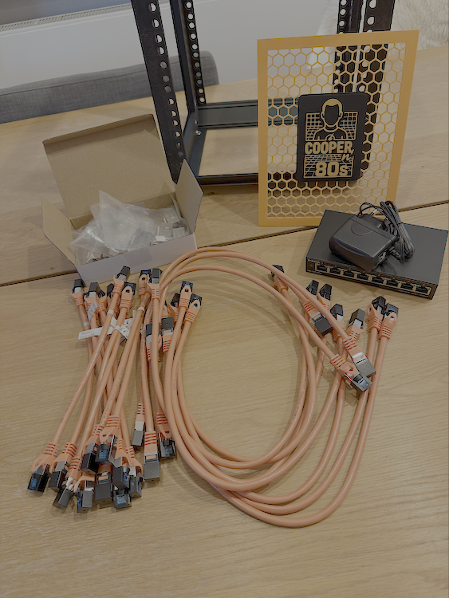
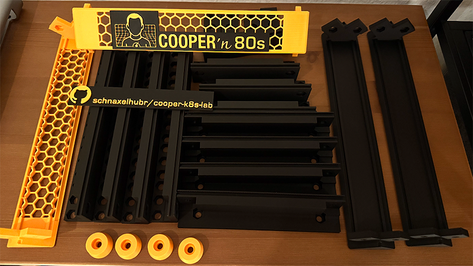
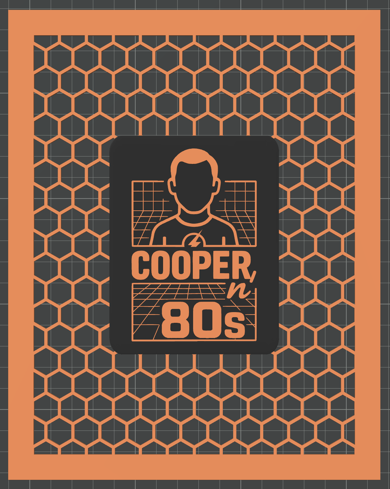
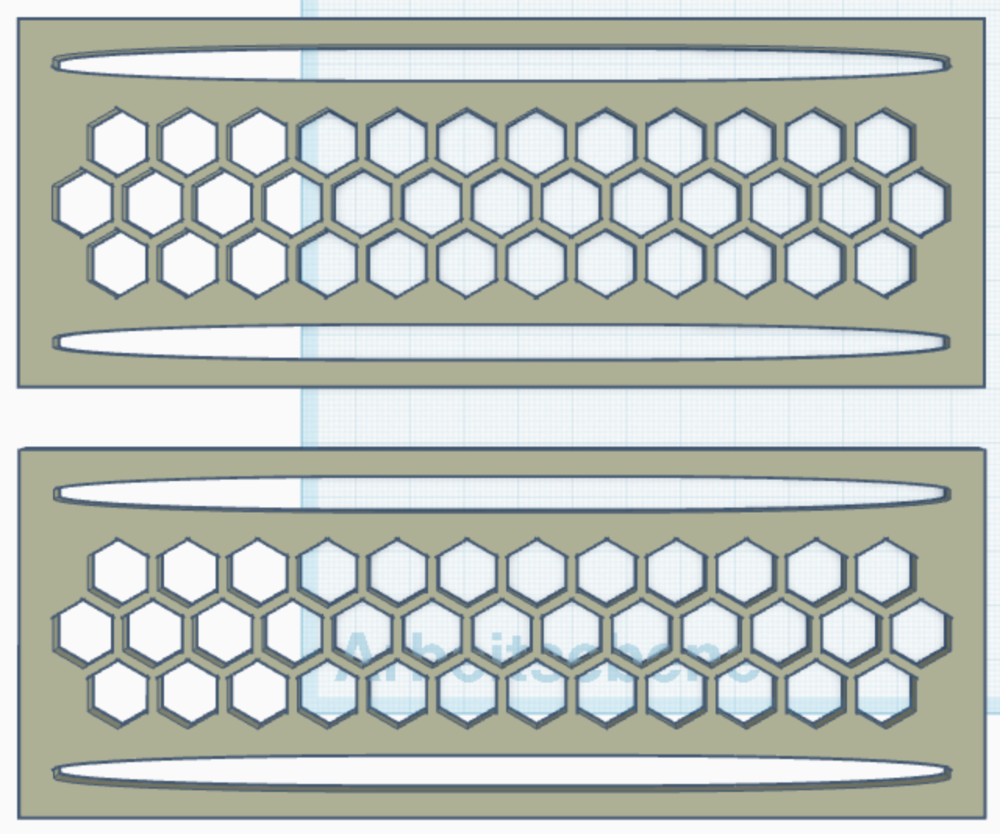
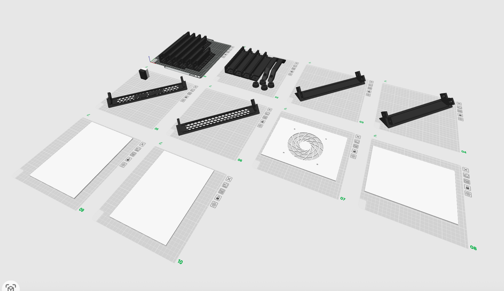
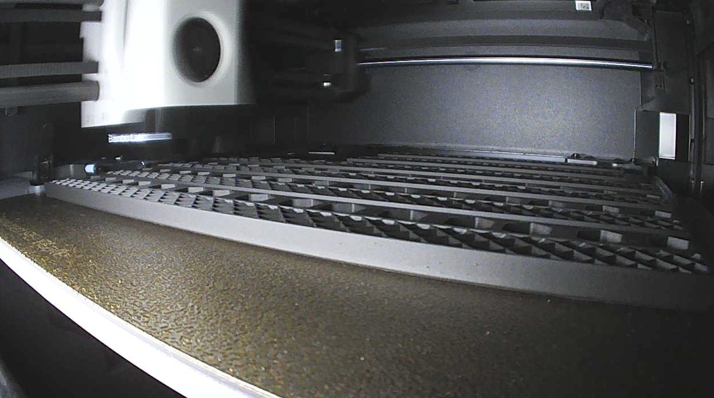
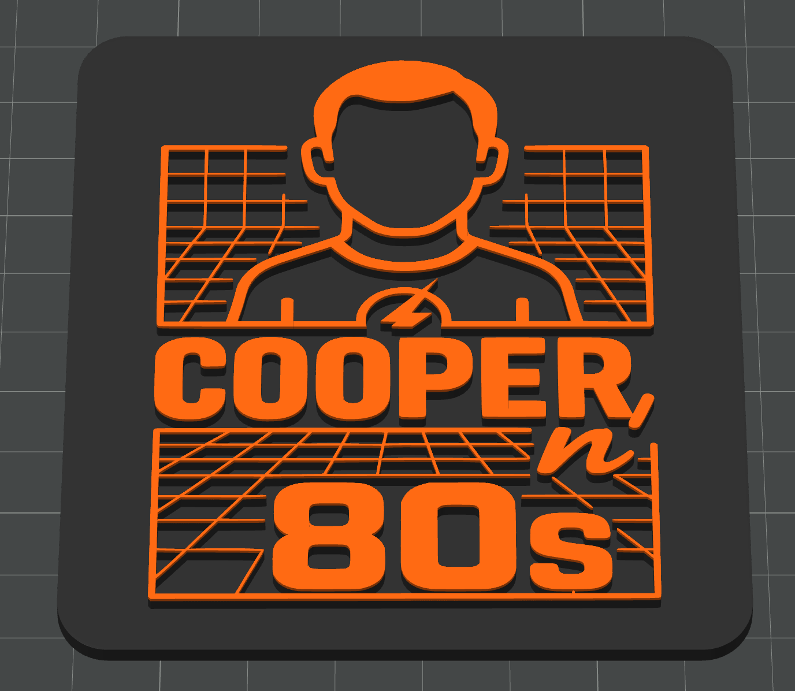

# Cooper'n'80s Project Journal

> *"A daily log of scientific progress, theoretical breakthroughs, and the occasional mechanical triumph"*

## 📊 Project Dashboard

**Current Status (S01E03)**: Frame assembled, components delivered | **Invested**: €172.76 | **Next**: Equipment mounting → automation

| Category | Progress | Next Milestone |
|----------|----------|----------------|
| **🖨️ Hardware** | ██████████ 90% | Equipment mounting brackets |
| **📚 Documentation** | ████████░░ 80% | Implementation sections |
| **💰 Procurement** | ███████░░░ 70% | Mini PC deal finalization |
| **🚀 Implementation** | ████░░░░░░ 40% | Proxmox automation planning |

**🔮 Next Episode**: S01E04 - "The Equipment Integration" - *Switch mounting, patch panel printing, Mini PC procurement*

---

## 📺 Episode Guide

*In the spirit of The Big Bang Theory - where every breakthrough deserves proper documentation and every setback teaches us something valuable about the universe.*

**Navigation**: [Latest Episode ↓](#s01e03---the-assembly-protocol) | [Previous Episodes ↓](#s01e02---the-great-restructuring)

---

## 🎬 Episode S01E03 - "The Assembly Protocol"
**Tuesday, August 19, 2025**

### 📋 Episode Summary
In which our protagonist discovers that theory and practice diverge in fascinating ways, particularly when flanged screws meet carefully designed mounting holes, but engineering adaptability triumphs over rigid adherence to original specifications.

### 🔧 Assembly Breakthrough
- **✅ Frame Construction**: First physical assembly completed successfully
- **🎯 Hardware Reality Check**: M6 flanged screws sit on surface rather than recessed - aesthetically superior outcome
- **📏 Engineering Adaptation**: Top/bottom panels temporarily omitted for better assembly access
- **🔄 Iterative Approach**: Hex-pattern crossbeams lack panel mounting provisions - design evolution opportunity

  
*Left: M6 flanged bolts and precision-engineered frame components ready for assembly. Center: Frame construction with Cooper'n'80s branding integration. Right: Complete 8U structure showcasing professional rack-mount aesthetics*

### 🔍 Lessons Learned
- **Flanged Screw Advantage**: Surface mounting provides cleaner aesthetic than anticipated
- **Foot Hardware Issue**: Need 4x smaller-head screws for proper foot mounting
- **Access Strategy**: Panel-free assembly superior for equipment integration phase
- **Design Evolution**: Real-world assembly reveals optimization opportunities

### 📦 Equipment Delivery Milestone
- **✅ Network Infrastructure**: D-Link switch, patch cables, and keystone modules delivered
- **🔌 Power Planning**: Current 4-outlet PDU insufficient - expansion strategy required
- **🖨️ Next Print Queue**: Patch panel for keystone modules, D-Link switch mounting bracket
- **💾 Storage Strategy**: Separate floor/mounting system needed for Mini PC power supplies

*Complete network infrastructure delivery: D-Link DGS-1100-08V2 switch, 20x orange patch cables (0.25m/0.5m), and deleyCON Cat7 keystone modules - perfect color coordination with Cooper'n'80s branding*

**Equipment Quality Assessment**:
- **D-Link Switch**: Compact form factor, ideal for 8U rack integration
- **Orange Patch Cables**: Perfect brand consistency, high-visibility cable management
- **Keystone Modules**: Cat7 metal construction, silver finish provides nice contrast
- **Scale Verification**: All components appropriately sized for custom rack dimensions

### 💻 Mini PC Procurement Update
- **🤝 Business Contact**: Established relationship with supplier for competitive pricing
- **📊 Quantity Planning**: 3x units targeted for optimal cluster configuration
- **💰 Budget Optimization**: Commercial relationship enables better cost structure

### 🤖 Automation Research
- **🔬 Proxmox Deployment**: Investigating automated installation strategies
- **📋 Infrastructure as Code**: Planning template-driven deployment approach
- **⚡ Zero-Touch Goal**: Minimize manual configuration through systematic automation

### 🎯 Cooper Quote of the Day
> *"The fascinating thing about engineering is that when reality disagrees with your specifications, reality is usually suggesting a better approach - you just have to be scientifically open to the evidence."*

### 📊 Episode Metrics
| Metric | Progress | Details |
|--------|----------|---------|
| **Physical Assembly** | 🔧 Frame complete | 8U structure with integrated branding |
| **Equipment Status** | 📦 Network gear delivered | Switch, cables, keystones ready for mounting |
| **Procurement** | 💻 Mini PCs pending | Business relationship established |
| **Next Goal** | 🖨️ Equipment mounting | Brackets, patch panel, power distribution |

---

## 🎬 Episode S01E02 - "The Great Restructuring"
**Monday, August 18, 2025**

### 📋 Episode Summary
Our hero realizes that good content in poor structure is like a brilliant equation written on a napkin - technically correct but professionally inadequate.

### 🏗️ Repository Engineering
- **🚀 Release v0.2.0**: "Restructured for Navigation" 
- **📁 Professional Hierarchy**: Implemented enterprise-grade documentation structure
  - `01-vision/` - Philosophical foundation
  - `02-design/` - Architectural decisions  
  - `03-hardware/` - Physical implementation
  - `99-appendix/` - Meta-documentation
- **🧹 Technical Debt**: Eliminated redundant content and overlapping documentation
- **🔗 Navigation Optimization**: Cross-references and logical progression established

### 🖨️ Manufacturing Progress
- **✅ Frame Completion**: All structural components printed successfully
- **🎨 Custom Elements**: Cooper'n'80s branded side panels with integrated logo

*All printed frame components ready for assembly - featuring custom Cooper'n'80s branding and hex ventilation patterns*

 
*Custom side panel designs: 5U main panel with logo integration (left) and 1.5U ventilation extensions (right)*

- **📏 Quality Validation**: Dimensional accuracy confirmed with test assembly

### 🔍 Procurement Research
- **💻 Mini PC Sourcing**: Market analysis for i5-10500T systems
- **📊 Performance Modeling**: VM density calculations for 16GB vs 32GB configurations

### 🤖 AI Collaboration Challenges
- **⚠️ Performance Issues**: Claude AI experiencing content limits during extended sessions
- **🔧 Workaround Development**: Document upload strategy for context restoration
- **📈 Workflow Optimization**: Screenshot-based feedback loops prove highly effective

### 🛒 Network Infrastructure
- **📦 Equipment Ordered**: D-Link switch and patch cables (€77.09)
- **🔌 Connectivity Planning**: 20x orange patch cables for visual consistency

### 🎯 Cooper Quote of the Day
> *"The need to reorganize information into a logical structure is not obsessive-compulsive disorder. It's the application of systematic methodology to knowledge management."*

### 📊 Episode Metrics
| Metric | Progress | Details |
|--------|----------|---------|
| **Documentation** | 📁 4 sections | Professional hierarchy established |
| **3D Printing** | 🖨️ 100% frame | 722.26g PLA, all components ready |
| **Budget** | 💰 €172.67 | Hardware ordered, assembly pending |
| **Next Goal** | 🔧 Assembly | M6 bolts → frame build → Mini PCs |

---

## 🎬 Episode S01E01 - "The Repository Genesis"
**Sunday, August 17, 2025**

### 📋 Episode Summary
In which our protagonist decides that theoretical knowledge without practical implementation is like knowing the lyrics to "Soft Kitty" but never singing it to comfort a friend.

### 🔬 Scientific Progress
- **💡 Project Genesis**: Transform weeks of scattered planning into systematic documentation
- **📚 Platform Decision**: GitHub repository as primary documentation and collaboration hub
- **🤖 AI Collaboration**: Partner with Claude AI for content generation and structural optimization
- **📐 Design Conclusions**: Major architectural decisions documented
  - [Path A vs Path B Strategy](../02-design/kubernetes-strategy.md)
  - [Network Architecture](../02-design/network-topology.md) 
  - [Switch Selection Analysis](../03-hardware/components/networking.md)
  - [CPU Selection Criteria](../03-hardware/components/mini-pcs.md)

### 🖨️ Manufacturing Update
- **Base Frame Components**: Initial 3D printing commenced
- **Material Strategy**: PLA Matte (structural) + PETG (heat-sensitive) confirmed

 
*Left: Print plates prepared for base frame components. Right: Bambu P1S in action during initial printing session*

*Cooper'n'80s logo 3D print preview showing dual-color scheme (orange and black)*

- **Print Quality**: Bambu P1S performing within theoretical parameters

### 🛒 Procurement Activities
- **M6 Hardware**: Bolts and nuts ordered (€31.49)
- **Keystone Modules**: deleyCON Cat7 metal couplers ordered (€33.99)
- **Power Distribution**: DIGITUS 1U power strip ordered (€19.99)

### 🎯 Cooper Quote of the Day
> *"I don't have a problem with change. I have a problem with the way people change things without using the scientific method to validate their approach."*

### 📊 Episode Metrics
| Metric | Progress | Details |
|--------|----------|---------|
| **Documentation** | 📋 Planning | Repository setup, AI collaboration |
| **3D Printing** | 🖨️ Started | Base components, material strategy |
| **Budget** | 💰 €85.47 | Initial hardware orders placed |
| **Next Goal** | 🏗️ Structure | Complete printing → assembly prep |

---

**Journal Philosophy**: *"Every day of progress deserves documentation, every setback teaches us something valuable, and every breakthrough brings us closer to the theoretically perfect homelab."*

**Maintained by**: Enterprise Architect with OCD-level attention to detail and an unreasonable fondness for scientific methodology applied to infrastructure projects.