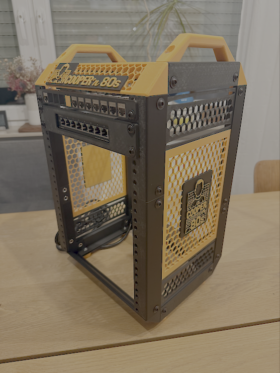
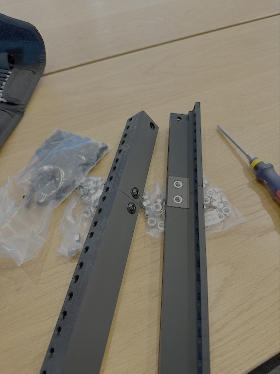

# Cooper'n'80s Project Journal

> *"A daily log of scientific progress, theoretical breakthroughs, and the occasional mechanical triumph"*

## 📊 Project Dashboard

**Current Status (S01E04)**: Mini PCs ordered, dual repository operational | **Invested**: €172.67 | **Next**: Hardware delivery → integration

| Category | Progress | Next Milestone |
|----------|----------|----------------|
| **🖨️ Hardware** | ██████████ 95% | Mini PC delivery and mounting |
| **📚 Documentation** | ████████▓▓ 85% | CMDB templates and dual-repo docs |
| **💰 Procurement** | ██████████ 100% | All major components ordered |
| **🚀 Implementation** | ██████░░░░ 60% | Automation planning and CMDB |

**🔮 Next Episode**: S01E05 - "The Great Integration" - *Mini PC delivery, final assembly, first boot*

---

## 📺 Episode Guide

*In the spirit of The Big Bang Theory - where every breakthrough deserves proper documentation and every setback teaches us something valuable about the universe.*

**Navigation**: [Latest Episode ↓](#s01e04---the-hardware-breakthrough) | [Previous Episodes ↓](#s01e03---the-assembly-protocol)

---

## 🎬 Episode S01E04 - "The Infrastructure Revolution"
**Wednesday, August 20, 2025**

### 📋 Episode Summary
In which our protagonist achieves the crucial hardware milestone, navigates the inevitable 3D printing iterations with scientific precision, implements an enterprise-grade dual-repository strategy, and deploys a complete enterprise infrastructure platform that transforms the lab from hardware procurement to production-ready operations.

### 🖥️ **MAJOR HARDWARE BREAKTHROUGH: Mini PCs Ordered!**

**💻 Dell OptiPlex 3080 Micro Specifications:**
- **CPU**: Intel Core i5-10500T (6C/12T) ✅ 
- **Memory**: 32GB DDR4 (upgrade from planned 16GB!) ✅
- **Storage**: 512GB SSD ✅
- **Network**: Integrated WLAN + Gigabit Ethernet ✅
- **OS**: Windows 11 Pro (will be replaced with Linux) ✅
- **Quantity**: 3x identical units for perfect cluster symmetry ✅

**🤝 Supplier Relationship Success:**
- Excellent support from business contact
- Professional procurement process
- Future dedicated spotlight planned for supplier recognition

### 🖨️ 3D Printing Lessons & Iterations

**Engineering Reality Check** - Real-world 3D printing requires iteration:

#### **Print Orientation Challenges:**
- **Handles**: Wrong orientation resulted in poor surface finish
- **Solution**: Reprinted with corrected orientation
- **Lesson**: Test print orientation for decorative elements

#### **Component Sizing Issues:**
- **D-Link Bracket**: Initially sized for different D-Link model
- **Problem**: Too large for DGS-1100-08V2
- **Engineering Solution**: Custom scaling in X- and Z-axis
- **Result**: Perfect fit achieved via parametric adjustment
- **Asset**: Custom file `DGS_1100-08vs_new.3mf` saved for future use

#### **Assembly Orientation Errors:**
- **Orange Crossbeam + Logo**: Mounted incorrectly (wrong side)
- **Impact**: Logo positioning and structural groove misaligned
- **Solution**: Complete reprint of orange crossbeam with logo
- **Status**: Reprinted components ready for proper assembly

#### **Completed Manufacturing:**
- ✅ **Side Panels**: Custom Cooper'n'80s ventilation panels completed
- ✅ **Structural Elements**: All frame components functional
- ⚪ **Final Details Pending**: Front covers, Mini PC mounting brackets, finishing touches

### 🔒 Infrastructure Evolution: Dual Repository Strategy

**Enterprise-Grade Information Architecture Implemented:**

#### **Repository Separation:**
- **🌐 cooper-n-80s (Public - GitHub)**: Learning documentation, sanitized templates
- **🔒 cooper-ops (Private - Forgejo Self-hosted)**: Real operational data and automation

#### **Security Implementation:**
- **Private Git Server**: Forgejo on LXC container (git.sammet.me)
- **SSH Authentication**: ed25519 key management
- **Data Classification**: Sensitive operational data properly protected

#### **CMDB Architecture:**
- **Enterprise YAML Structures**: NetBox migration-ready CMDB
- **Asset Management**: Complete device lifecycle tracking
- **Template Generation**: Public templates derived from private operational data

### 🏗️ **RACK ASSEMBLY MILESTONE: Enterprise Infrastructure Ready**

**Evening Assembly Achievement - Professional Infrastructure Platform:**

  
*Left: Complete 8U rack with professional Cooper'n'80s branding and orange accent elements. Center: Network infrastructure integration with D-Link switch and keystone patch panel. Right: Rear perspective showing cable management preparation and power distribution.*

#### **Assembly Achievements:**
- ✅ **Professional Branding**: Cooper'n'80s logo integration with perfect orange accents
- ✅ **Network Infrastructure**: D-Link DGS-1100-08V2 mounted and ready for operation
- ✅ **Patch Panel**: Keystone panel installed with professional finish
- ✅ **Ventilation Design**: Custom hex patterns provide optimal airflow
- ✅ **Power Distribution**: PDU mounted and cable routing prepared
- ✅ **Structural Integrity**: Solid, stable, enterprise-grade construction

#### **Outstanding Quality:**
- **Fit and Finish**: Professional rack-mount aesthetics achieved
- **Brand Integration**: Orange Cooper'n'80s elements create cohesive visual identity
- **Equipment Ready**: Core infrastructure prepared for Mini PC integration
- **Cable Management**: Organized infrastructure for clean final assembly

**Evening Infrastructure Breakthrough - From Git Server to Enterprise Platform:**

#### **Unified Docker Compose Stack:**
```yaml
# Cooper'n'80s Enterprise Infrastructure
services:
  forgejo:    # Git server with migrated cooper-ops repository
  vault:      # HashiCorp Vault secrets management
  # Network: cooper-infrastructure (shared service discovery)
```

#### **HashiCorp Vault Integration:**
- **Platform**: Vault 1.15.6 with native CLI integration
- **Access**: http://vault.sammet.me:8200 (full UI + API)
- **Security**: 5-key Shamir sharing, keys in Vaultwarden password manager
- **Secrets**: SSH keys, network credentials, future K8s integration ready

### 🔐 **ENTERPRISE PLATFORM DEPLOYMENT: Unified Infrastructure**
- ✅ **Repository Preservation**: cooper-ops safely migrated to unified storage
- ✅ **Modern Standards**: compose.yaml format, eliminated deprecated config
- ✅ **Enterprise Backup**: 24h LXC backup to 3 geographic locations

### 🛠️ Operational Infrastructure

#### **Git Server Deployment:**
- **Platform**: Forgejo in Docker Compose on LXC
- **Features**: SSH + HTTPS access, private repository hosting
- **Integration**: VS Code workspace with both repositories
- **Workflow**: Separate commit streams for public/private content

#### **Data Migration Excellence:**
```
cooper-n-80s/
├── git/macbook/          # SSH keys for development access
├── network/dlink/        # Switch administrative credentials
├── kubernetes/           # Future K8s cluster integration
└── infrastructure/       # Future automation service accounts
```

#### **Next Integration Phase:**
- 🔧 **Mini PC Mounting**: Custom brackets for Dell OptiPlex 3080 Micro  
- 🔌 **Front Covers**: Clean aesthetic panels for professional finish
- 📦 **Final Details**: Remaining mounting hardware and cable management
- 🌐 **Network Activation**: Patch cables and VLAN 10 configuration testing
- **Network Infrastructure**: Complete D-Link switch and patch panel documentation
- **Asset Tracking**: Serial numbers, procurement costs, lifecycle management
- **NetBox Readiness**: Enterprise DCIM/IPAM compatible structure

#### **CMDB Enhancement:**

```
🖥️ Hardware        ████████████ 100% - Mini PCs ordered (32GB upgrade!)
🏗️ Infrastructure  ████████████ 100% - Unified platform operational
🔐 Secrets Mgmt    ████████████ 100% - Vault deployed with production secrets
🖨️ 3D Printing     █████████▓▓ 90% - Core complete, finishing touches pending
🌐 Networking      ████████░░░░ 80% - Switch delivered, mounting pending
🔧 Integration     ██████░░░░░░ 60% - Final assembly and Mini PC mounting
```

### 📊 Updated Cluster Specifications

**Massive Memory Upgrade Impact:**
```
Original Plan:  3x 16GB = 48GB total cluster memory
Actual Order:   3x 32GB = 96GB total cluster memory
Performance:    2x memory capacity = significantly higher VM density
Pod Capacity:   Estimated 300-400 pods (vs 150-250 originally planned)
```

**Cost-Benefit Analysis:**
- **Memory doubling** enables much more realistic enterprise workload simulation
- **Future-proofing** for advanced scenarios and multiple paradigm testing
- **Professional procurement** through established business relationship

### 🔬 Scientific Discoveries

#### **3D Printing Methodology:**
- **Iteration is Normal**: Complex assemblies require multiple print cycles
- **Parametric Design**: Custom scaling enables component adaptation
- **Print Orientation**: Critical for aesthetic components
- **Documentation**: Asset management of custom modifications essential

#### **Enterprise Repository Patterns:**
- **Data Classification**: Critical for security and compliance
- **Template Generation**: Public learning value without operational risk
- **Multi-Repository Workflows**: VS Code workspace management highly effective

#### **Infrastructure Platform Lessons:**
- **Modern Docker Compose**: compose.yaml format, service integration
- **Vault Security**: Native CLI superior to container exec approaches
- **Unified Deployment**: Single compose stack enables systematic management
- **Enterprise Backup**: LXC-level backup provides comprehensive protection

### 🎭 Cooper Quote of the Day
> *"The remarkable thing about systematic engineering is how a simple hardware procurement decision, when approached with proper methodology, naturally evolves into a comprehensive enterprise infrastructure platform that demonstrates the emergent complexity inherent in well-designed systems."*

### 📊 Episode Metrics
| Metric | Progress | Details |
|--------|----------|---------|
| **Hardware Procurement** | 🎉 COMPLETE | 3x Dell OptiPlex 3080 Micro ordered |
| **Infrastructure Platform** | 🏗️ OPERATIONAL | Unified Forgejo + Vault deployment |
| **Secrets Management** | 🔐 ENTERPRISE | HashiCorp Vault with production patterns |
| **Repository Architecture** | ✅ Implemented | Dual-repo strategy operational |
| **CMDB Maturity** | 📈 Enhanced | Enterprise-grade structure achieved |
| **3D Printing Accuracy** | 🔄 Iterative | Multiple components reprinted for precision |

### 🚀 Next Episode Preview
**S01E05 - "The Hardware Integration"** - *Mini PC delivery, rack mounting with enterprise infrastructure, and the moment when theoretical Kubernetes architecture meets physical silicon reality in a production-ready platform environment.*

## 🎬 Episode S01E03 - "The Assembly Protocol"
**Tuesday, August 19, 2025**

### 📋 Episode Summary
In which our protagonist discovers that theory and practice diverge in fascinating ways, particularly when flanged screws meet carefully designed mounting holes, but engineering adaptability triumphs over rigid adherence to original specifications.

### 🔧 Assembly Breakthrough
- **✅ Frame Construction**: First physical assembly completed successfully
- **🎯 Hardware Reality Check**: M6 flanged screws sit on surface rather than recessed - aesthetically superior outcome
- **📏 Engineering Adaptation**: Top/bottom panels temporarily omitted for better assembly access
- **🔄 Iterative Approach**: Hex-pattern crossbeams lack panel mounting provisions - design evolution opportunity

  
*Left: M6 flanged bolts and precision-engineered frame components ready for assembly. Center: Frame construction with Cooper'n'80s branding integration. Right: Complete 8U structure showcasing professional rack-mount aesthetics*

### 🔍 Lessons Learned
- **Flanged Screw Advantage**: Surface mounting provides cleaner aesthetic than anticipated
- **Foot Hardware Issue**: Need 4x smaller-head screws for proper foot mounting
- **Access Strategy**: Panel-free assembly superior for equipment integration phase
- **Design Evolution**: Real-world assembly reveals optimization opportunities

### 📦 Equipment Delivery Milestone
- **✅ Network Infrastructure**: D-Link switch, patch cables, and keystone modules delivered
- **🔌 Power Planning**: Current 4-outlet PDU insufficient - expansion strategy required
- **🖨️ Next Print Queue**: Patch panel for keystone modules, D-Link switch mounting bracket
- **💾 Storage Strategy**: Separate floor/mounting system needed for Mini PC power supplies


*Complete network infrastructure delivery: D-Link DGS-1100-08V2 switch, 20x orange patch cables (0.25m/0.5m), and deleyCON Cat7 keystone modules - perfect color coordination with Cooper'n'80s branding*

**Equipment Quality Assessment**:
- **D-Link Switch**: Compact form factor, ideal for 8U rack integration
- **Orange Patch Cables**: Perfect brand consistency, high-visibility cable management
- **Keystone Modules**: Cat7 metal construction, silver finish provides nice contrast
- **Scale Verification**: All components appropriately sized for custom rack dimensions

### 💻 Mini PC Procurement Update
- **🤝 Business Contact**: Established relationship with supplier for competitive pricing
- **📊 Quantity Planning**: 3x units targeted for optimal cluster configuration
- **💰 Budget Optimization**: Commercial relationship enables better cost structure

### 🤖 Automation Research
- **🔬 Proxmox Deployment**: Investigating automated installation strategies
- **📋 Infrastructure as Code**: Planning template-driven deployment approach
- **⚡ Zero-Touch Goal**: Minimize manual configuration through systematic automation

### 🎯 Cooper Quote of the Day
> *"The fascinating thing about engineering is that when reality disagrees with your specifications, reality is usually suggesting a better approach - you just have to be scientifically open to the evidence."*

### 📊 Episode Metrics
| Metric | Progress | Details |
|--------|----------|---------|
| **Physical Assembly** | 🔧 Frame complete | 8U structure with integrated branding |
| **Equipment Status** | 📦 Network gear delivered | Switch, cables, keystones ready for mounting |
| **Procurement** | 💻 Mini PCs pending | Business relationship established |
| **Next Goal** | 🖨️ Equipment mounting | Brackets, patch panel, power distribution |

---

## 🎬 Episode S01E02 - "The Great Restructuring"
**Monday, August 18, 2025**

### 📋 Episode Summary
Our hero realizes that good content in poor structure is like a brilliant equation written on a napkin - technically correct but professionally inadequate.

### 🏗️ Repository Engineering
- **🚀 Release v0.2.0**: "Restructured for Navigation" 
- **📁 Professional Hierarchy**: Implemented enterprise-grade documentation structure
  - `01-vision/` - Philosophical foundation
  - `02-design/` - Architectural decisions  
  - `03-hardware/` - Physical implementation
  - `99-appendix/` - Meta-documentation
- **🧹 Technical Debt**: Eliminated redundant content and overlapping documentation
- **🔗 Navigation Optimization**: Cross-references and logical progression established

### 🖨️ Manufacturing Progress
- **✅ Frame Completion**: All structural components printed successfully
- **🎨 Custom Elements**: Cooper'n'80s branded side panels with integrated logo


*All printed frame components ready for assembly - featuring custom Cooper'n'80s branding and hex ventilation patterns*

 
*Custom side panel designs: 5U main panel with logo integration (left) and 1.5U ventilation extensions (right)*

- **📏 Quality Validation**: Dimensional accuracy confirmed with test assembly

### 🔍 Procurement Research
- **💻 Mini PC Sourcing**: Market analysis for i5-10500T systems
- **📊 Performance Modeling**: VM density calculations for 16GB vs 32GB configurations

### 🤖 AI Collaboration Challenges
- **⚠️ Performance Issues**: Claude AI experiencing content limits during extended sessions
- **🔧 Workaround Development**: Document upload strategy for context restoration
- **📈 Workflow Optimization**: Screenshot-based feedback loops prove highly effective

### 🛒 Network Infrastructure
- **📦 Equipment Ordered**: D-Link switch and patch cables (€77.09)
- **🔌 Connectivity Planning**: 20x orange patch cables for visual consistency

### 🎯 Cooper Quote of the Day
> *"The need to reorganize information into a logical structure is not obsessive-compulsive disorder. It's the application of systematic methodology to knowledge management."*

### 📊 Episode Metrics
| Metric | Progress | Details |
|--------|----------|---------|
| **Documentation** | 📁 4 sections | Professional hierarchy established |
| **3D Printing** | 🖨️ 100% frame | 722.26g PLA, all components ready |
| **Budget** | 💰 €172.67 | Hardware ordered, assembly pending |
| **Next Goal** | 🔧 Assembly | M6 bolts → frame build → Mini PCs |

---

## 🎬 Episode S01E01 - "The Repository Genesis"
**Sunday, August 17, 2025**

### 📋 Episode Summary
In which our protagonist decides that theoretical knowledge without practical implementation is like knowing the lyrics to "Soft Kitty" but never singing it to comfort a friend.

### 🔬 Scientific Progress
- **💡 Project Genesis**: Transform weeks of scattered planning into systematic documentation
- **📚 Platform Decision**: GitHub repository as primary documentation and collaboration hub
- **🤖 AI Collaboration**: Partner with Claude AI for content generation and structural optimization
- **📐 Design Conclusions**: Major architectural decisions documented
  - [Path A vs Path B Strategy](../02-design/kubernetes-strategy.md)
  - [Network Architecture](../02-design/network-topology.md) 
  - [Switch Selection Analysis](../03-hardware/components/networking.md)
  - [CPU Selection Criteria](../03-hardware/components/mini-pcs.md)

### 🖨️ Manufacturing Update
- **Base Frame Components**: Initial 3D printing commenced
- **Material Strategy**: PLA Matte (structural) + PETG (heat-sensitive) confirmed

 
*Left: Print plates prepared for base frame components. Right: Bambu P1S in action during initial printing session*


*Cooper'n'80s logo 3D print preview showing dual-color scheme (orange and black)*

- **Print Quality**: Bambu P1S performing within theoretical parameters

### 🛒 Procurement Activities
- **M6 Hardware**: Bolts and nuts ordered (€31.49)
- **Keystone Modules**: deleyCON Cat7 metal couplers ordered (€33.99)
- **Power Distribution**: DIGITUS 1U power strip ordered (€19.99)

### 🎯 Cooper Quote of the Day
> *"I don't have a problem with change. I have a problem with the way people change things without using the scientific method to validate their approach."*

### 📊 Episode Metrics
| Metric | Progress | Details |
|--------|----------|---------|
| **Documentation** | 📋 Planning | Repository setup, AI collaboration |
| **3D Printing** | 🖨️ Started | Base components, material strategy |
| **Budget** | 💰 €85.47 | Initial hardware orders placed |
| **Next Goal** | 🏗️ Structure | Complete printing → assembly prep |

---

**Journal Philosophy**: *"Every day of progress deserves documentation, every setback teaches us something valuable, and every breakthrough brings us closer to the theoretically perfect homelab."*

**Maintained by**: Enterprise Architect with OCD-level attention to detail and an unreasonable fondness for scientific methodology applied to infrastructure projects.