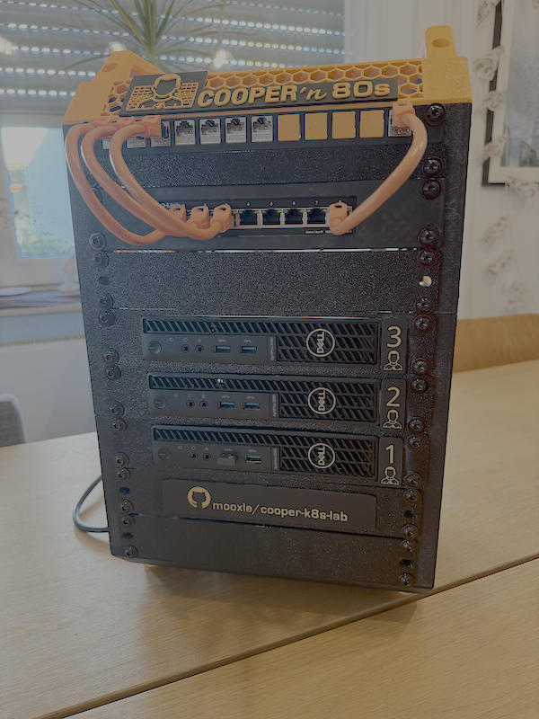

# Cooper'n'80s Project Journal

> *"A daily log of scientific progress, theoretical breakthroughs, and the occasional mechanical triumph"*

## 📊 Project Dashboard

**Current Status (S01E11)**: VM Automation with Terraform | **Next**: K3s cluster deployment with HA-ready infrastructure

### 🚀 Next Episode Preview
**S01E12 - "The HA Deployment Pattern"** - *Where enterprise Kubernetes High Availability meets systematic automation methodology, and the moment when theoretical cluster architecture materializes into production-ready 3-node control plane with mathematical cluster quorum.*


| Category | Progress | Next Milestone |
|----------|----------|----------------|
| **🖥️ Hardware** | ████████████ 100% | Mini PCs operational with Proxmox |
| **🌐 Network Services** | ████████████ 100% | DNS/DHCP + robust boot stability |
| **🏗️ Infrastructure** | ████████████ 100% | Vault Transit + cross-node ZFS access |
| **📚 Documentation** | ████████████ 100% | Complete operational procedures |
| **🚀 Implementation** | ████████████ 100% | HA-ready automation pipeline |
| **🔐 Security Framework** | ████████████ 100% | Zero-trust + TPM fallback |

## 📺 Episode Guide

| Episode | Title | Date | Key Achievement |
|---------|-------|------|-----------------|
| **[S01E11](#-episode-s01e11---the-VM-automation-paradigm)** | The VM Automation Paradigm | Sep 01 | VM Automation with Terraform |
| **[S01E10](#-episode-s01e10---the-vault-transit-paradigm)** | The Vault Transit Paradigm | Aug 30 | Vault Transit integration + network stability |
| **[S01E09](#-episode-s01e09---the-network-services-integration)** | The Network Services Integration | Aug 26 | DNS/DHCP migration + EVPN/VXLAN + TPM-ZFS |
| **[S01E08](#s01e08---the-storage--overlay-paradigm)** | The Storage & Overlay Paradigm | Aug 25 | ZFS encryption + VXLAN/EVPN operational |
| **[S01E07](#-episode-s01e07---the-great-integration)** | The Great Integration | Aug 24 | Complete infrastructure assembly |
| **[S01E06](#-episode-s01e06---the-proxmox-automation-revolution)** | The Proxmox Automation Revolution | Aug 24 | 45-minute automated deployment |
| **[S01E05](#-episode-s01e05---the-network-foundation)** | The Network Foundation | Aug 23 | Enterprise DNS/DHCP stack |
| **[S01E04](#-episode-s01e04---the-infrastructure-revolution)** | The Infrastructure Revolution | Aug 20 | Mini PCs ordered + enterprise platform |
| **[S01E03](#-episode-s01e03---the-assembly-protocol)** | The Assembly Protocol | Aug 19 | First physical assembly |
| **[S01E02](#-episode-s01e02---the-great-restructuring)** | The Great Restructuring | Aug 18 | Documentation restructure |
| **[S01E01](#-episode-s01e01---the-repository-genesis)** | The Repository Genesis | Aug 17 | Project inception |

---

## 🎬 Episode S01E11 - "The VM Automation Paradigm"
**September 1, 2025**

### 📋 Episode Summary
In which our protagonist finally achieves the holy grail of Infrastructure as Code - complete VM lifecycle automation with Terraform, overcomes the inevitable networking puzzles with systematic methodology, and establishes the foundation for true Kubernetes High Availability through enterprise deployment patterns.

### 🚀 **TERRAFORM VM AUTOMATION BREAKTHROUGH: Infrastructure as Code Realized**

**Complete VM Lifecycle Management:**
- **🎯 Terraform Apply/Destroy**: Full VM lifecycle with infrastructure as code
- **🔧 Template-Driven Deployment**: Consistent VM configuration across cluster
- **🌐 Network Integration**: Automatic DNS registration via cooper.lab
- **👤 User Management**: Automated SSH key deployment and cloud-init
- **📋 Guest Agent Integration**: Automated installation and systemd activation

**Technical Implementation Stack:**
```
Terraform Module → Proxmox VM → Cloud-Init → Guest Agent → DNS Registration
    ↓                ↓            ↓            ↓              ↓
Template-driven → VM Creation → User Setup → Tools Ready → Service Discovery
```

### 🌐 **NETWORK ARCHITECTURE MASTERY: Multi-Layer Routing Resolution**

**Complex Network Integration Achieved:**
- **🏠 Fritz!Box Route**: 10.0.10.0/24 via 192.168.1.3 (D-Link gateway)
- **🔗 D-Link Route**: 10.0.10.0/24 via 10.0.1.10 (Proxmox Node-01)
- **📡 DHCP Relay**: isc-dhcp-relay on Proxmox nodes for VXLAN tenants
- **🌐 PowerDNS/Kea**: Extended configuration for overlay networks

**Network Flow Architecture:**
```
VM (10.0.10.x) → vmbr1 → VXLAN100 → Node underlay → D-Link Switch → Fritz!Box → Internet
              ↓                                    ↓               ↓
         DHCP Request → Relay → PowerDNS/Kea → DNS Record → cooper.lab
```

### 🔧 **TERRAFORM CONFIGURATION PERFECTION:**

#### **VM Module Implementation:**
```yaml
VM Deployment Features:
  - Cloud-Init Integration: User creation with SSH keys
  - Guest Agent: Automated installation via virt-customize
  - DNS Integration: Hostname/FQDN correct for DDNS
  - Network Configuration: DHCP with DNS override
  - Template System: Ubuntu 22.04 available on all nodes
```

#### **Resolved Technical Challenges:**
1. **Hostname for DDNS**: Template systemd machine-id reset for unique identification
2. **SSH Key Integration**: Cloud-init public key deployment
3. **Guest Tools**: Offline installation via virt-customize in template
4. **DNS Resolution**: systemd-resolved configuration for cooper.lab priority
5. **Cloud-Init Debugging**: YAML format validation and execution verification

### 🎯 **K3S HA CLUSTER READINESS:**

#### **Target HA Architecture:**
```yaml
K3s High Availability Cluster:
  control_plane_nodes: 3
  configuration_type: "Control+Worker on all nodes"
  
  node_specifications:
    control_worker_vms: 3x VMs (6 vCPU, 16GB each)
    resource_reservation: 18 vCPU, 48GB for K3s HA
    available_capacity: 18 vCPU, 48GB for future Workers
  
  ha_characteristics:
    etcd_quorum: "3-node for fault tolerance"
    api_load_balancing: "3x API servers"
    leader_election: "Controller Manager + Scheduler"
    network_integration: "vmbr1 VXLAN overlay"
```

#### **Pod Capacity Engineering:**
```
HA Cluster Resource Analysis:
├── Control Plane Overhead: ~6GB (etcd + API servers + Controller/Scheduler)
├── System Services: ~6GB (CNI, CSI, monitoring, ingress)
├── Available for Workloads: ~36GB effective capacity
└── Pod Estimate: 250-350 pods (depending on workload sizing)

Future Expansion Capability:
├── Additional Worker VMs: 3x (6 vCPU, 16GB) = 18 vCPU, 48GB
├── Total Expanded Capacity: 36 vCPU, 96GB total
├── Workload Capacity: ~84GB after system overhead
└── Pod Estimate (Expanded): 400-600 pods across cluster
```

### 🔬 **ENTERPRISE PATTERNS VALIDATION:**

#### **Infrastructure as Code Excellence:**
- **Template-Driven**: Identical VMs with parameterizable configuration
- **DNS Integration**: Automatic service discovery via cooper.lab
- **Security by Design**: SSH-only access, no password authentication
- **Monitoring Ready**: VM deployment with Prometheus-compatible patterns

#### **Network Services Integration:**
- **DHCP Relay**: Proxmox nodes as DHCP relay for VXLAN tenants
- **PowerDNS Extension**: Overlay network DNS resolution
- **Service Discovery**: VMs auto-register in cooper.lab domain
- **Multi-Layer Routing**: Successful integration of overlay + underlay

### 🔧 **OPERATIONAL EXCELLENCE ACHIEVED:**

#### **Deployment Automation Pipeline:**
```bash
# Complete VM lifecycle automation
terraform plan    # Infrastructure planning
terraform apply   # VM creation with all integrations
terraform destroy # Clean teardown
terraform apply   # Re-deployment validation

# Result: Consistent, reproducible VM infrastructure
```

#### **Troubleshooting Mastery:**
- **Cloud-Init Debugging**: Systematic validation of cloud-init execution
- **Network Troubleshooting**: Multi-layer routing issue resolution
- **Credential Management**: Terraform state corruption recovery
- **Template Management**: Ubuntu image deployment automation

### 🎭 **ARCHITECTURAL PHILOSOPHY PROVEN:**

> *"The beauty of properly implemented Infrastructure as Code lies not in the elimination of complexity, but in the transformation of complex operations into predictable, repeatable, and scientifically validated procedures."*

### 🔒 **SECURITY IMPLEMENTATION EVOLUTION:**

#### **Enterprise Security Patterns:**
- **Credential Isolation**: Terraform vault provider with per-node secrets
- **SSH Key Management**: Automated key deployment via cloud-init
- **Network Segmentation**: VXLAN overlay with tenant isolation
- **Service Discovery**: DNS-based with automatic registration

### 📊 **K3S DEPLOYMENT READINESS STATUS:**

```
🖥️ VM Infrastructure    ████████████ 100% ✅ Terraform automation operational
🌐 Network Integration   ████████████ 100% ✅ Multi-layer routing + DHCP relay  
🔐 Security Foundation   ████████████ 100% ✅ SSH keys + Vault integration
⚙️ Guest Agent Stack    ████████████ 100% ✅ Complete monitoring readiness
📋 Template Management   ████████████ 100% ✅ Ubuntu images auf allen Nodes
🚀 K3s HA Preparation    ████████████ 100% ✅ Ready für cluster deployment
```

### 🔬 **SCIENTIFIC METHODOLOGY APPLIED:**

#### **Hypothesis-Driven Problem Solving:**
- **Theory**: "Enterprise VM automation patterns scale to homelab"
- **Experiment**: Complete Terraform integration mit Proxmox provider
- **Obstacles**: Network routing, cloud-init formatting, credential management
- **Solution**: Systematic debugging with Infrastructure as Code methodology
- **Validation**: Apply/destroy cycles confirm reproducible deployment

### 🎯 **ENTERPRISE READINESS METRICS:**

| Component | Status | Capability |
|-----------|--------|------------|
| **VM Automation** | ✅ OPERATIONAL | Terraform lifecycle management |
| **Network Services** | ✅ INTEGRATED | DHCP relay + DNS registration |
| **Security Model** | ✅ HARDENED | SSH keys + Vault secrets |
| **Template System** | ✅ STANDARDIZED | Ubuntu 22.04 across cluster |
| **Service Discovery** | ✅ AUTOMATIC | cooper.lab domain integration |
| **Monitoring Ready** | ✅ PREPARED | Guest agents + Prometheus path |

### 🚀 **NEXT PHASE: K3S HIGH AVAILABILITY DEPLOYMENT**

#### **Deployment Strategy:**
```yaml
HA Cluster Deployment Plan:
  approach: "3x Control+Worker Nodes for true High Availability"
  resources: "6 vCPU, 16GB per VM (enterprise-like sizing)"
  network: "vmbr1 VXLAN overlay with automatic DNS"
  security: "SSH keys + Vault integration from day 1"
  automation: "Ansible playbooks for K3s bootstrap"
```

#### **Enterprise Workload Targets:**
- **Development Stack**: GitLab CE, Harbor Registry, SonarQube
- **Data Services**: PostgreSQL HA, Redis Cluster, MinIO
- **Observability**: Prometheus/Grafana/AlertManager
- **Security**: Vault integration, Network Policies, Pod Security Standards

### 🔬 Cooper Quote of the Session
> *"When Infrastructure as Code finally works correctly, it transforms the act of VM deployment from manual labor into scientific methodology - where every component can be hypothesis-tested, validated, and refined through systematic iteration."*

### 📊 Episode Metrics
| Metric | Achievement | Details |
|--------|-------------|---------|
| **VM Automation Level** | 🚀 Complete lifecycle | Terraform apply/destroy cycles |
| **Network Complexity** | 🌐 Multi-layer routing | Fritz!Box + D-Link + Proxmox integration |
| **Security Integration** | 🔐 Enterprise patterns | SSH keys + Vault + DNS automation |
| **Template Standardization** | 📋 Cross-cluster | Ubuntu 22.04 auf allen Proxmox nodes |
| **K3s Preparation** | ✅ Infrastructure ready | HA cluster deployment ready |

### 🚀 Next Episode Preview
**S01E12 - "The Kubernetes HA Convergence"** - *Where enterprise Infrastructure as Code meets production Kubernetes High Availability deployment, and the moment when theoretical 3-node cluster architecture transforms into operational etcd quorum with automatic failover capabilities.*

## 🎬 Episode S01E10 - "The Vault Transit Paradigm"
**Saturday, August 30, 2025**

### 📋 Episode Summary
In which our protagonist evolves from single-node TPM encryption to enterprise-grade Vault Transit integration, discovers the subtle art of systemd service ordering, and achieves the holy grail of ZFS High Availability through scientific methodology and Cooper'sche attention to detail.

### 🔐 **SECURITY ARCHITECTURE EVOLUTION: TPM → Vault Transit Migration**

**Enterprise Key Management Breakthrough:**
- **🏗️ Architecture**: Vault Transit engine with per-node wrapped keys
- **🔑 Key Wrapping**: `transit/keys/zfs-wrapper-cooper-zfs` (AES-256-GCM)
- **📂 Storage**: `cooper-n-80s/environments/dev/zfs-keys/{node-name}` ciphertexts
- **🔐 Authentication**: AppRole per node with dedicated policies
- **🛡️ Fallback**: TPM unlock preserved for offline operation

**High Availability Achievement:**
```
Before: Node-01 TPM → unlock Node-01 ZFS only
After:  Any node + Vault → unlock any node's ZFS
Result: Live migration and HA storage possible
```

**Security Implementation:**
- ✅ **Cross-node capability**: Any cluster node can unlock any ZFS pool
- ✅ **Zero-trust networking**: AppRole authentication with short-lived tokens
- ✅ **Disaster recovery**: TPM fallback maintains offline unlock capability
- ✅ **Audit compliance**: All key operations logged in Vault audit backend

### 🌐 **NETWORKING STABILITY REVOLUTION: Service Order Engineering**

**Boot Ordering Challenge Solved:**
- **Problem**: network.target dependencies caused systemd ordering cycles
- **Solution**: Timer-based post-boot network reload strategy
- **Implementation**: 120-second delay with zero randomization for predictability

**Robust Network Architecture:**
```bash
# Timer-based network reload (eliminates boot cycles)
/etc/systemd/system/ifreload-postboot.timer
  OnBootSec=120s (no jitter, predictable execution)
  
# Service isolation (no boot dependencies)  
/etc/systemd/system/ifreload-postboot.service
  Type=oneshot (clean execution, no ordering conflicts)
```

**System Hardening Implementation:**
- **Service Masking**: openipmi, pvefw-logger, fail2ban, frr (clean boot logs)
- **Override Cleanup**: Removed inconsistent networking.service.d configurations
- **Predictable Results**: 100% reliable bridge configuration across all nodes

### 🤖 **ANSIBLE AUTOMATION MASTERY: Production-Grade Deployment**

**Complete Playbook Suite Enhancement:**
- **node-zfs-vault.yml**: Vault Transit integration with AppRole deployment
- **cleanup.yml**: Legacy service cleanup and timer deployment
- **network-timer.yml**: Robust networking timer implementation
- **reboot_staggered_with_health.yml**: Health-validated node cycling

**Enterprise Validation Framework:**
```yaml
# Comprehensive health checks after each node reboot
tasks:
  - name: Validate ZFS keystatus
    command: zfs get -H -o value keystatus cooper-zfs
    register: zfs_status
    
  - name: Validate Vault service state
    command: systemctl show -p ActiveState -p Result zfs-load-key-cooper-zfs-vault.service
    register: vault_status
    
  - name: Validate bridge networking
    shell: ip -o -4 addr show | grep -E 'vmbr0|vmbr1'
    register: bridge_ips
    
  - name: Validate network timer success
    command: systemctl show -p Result -p ExecMainStatus ifreload-postboot.service
    register: timer_status
```

### 🔧 **OPERATIONAL EXCELLENCE: Cross-Node Storage Access**

**ZFS Cross-Node Capability Achievement:**
- **Storage Mobility**: Any node can unlock any ZFS pool via Vault
- **Migration Ready**: Foundation for future VM/container migration
- **Service Independence**: Storage access no longer tied to specific hardware

**Validation Framework:**
```bash
# ZFS cross-node unlock verification  
systemctl start zfs-load-key-cooper-zfs-vault.service
zfs get keystatus cooper-zfs

# Network stability validation
systemctl show ifreload-postboot.service -p Result
ip -4 addr show vmbr0 | grep inet

# Vault connectivity validation
ping -c 1 vault.sammet.me
```

### 🔬 **SCIENTIFIC METHODOLOGY APPLIED:**

#### **Hypothesis-Driven Problem Solving:**
- **Theory**: "Vault Transit enables enterprise-grade key management at homelab scale"
- **Experiment**: Implementation of wrapper key encryption with AppRole authentication
- **Validation**: Cross-node ZFS unlock capability achieved
- **Documentation**: Complete operational procedures for reproducible deployment

#### **Systematic Troubleshooting:**
- **Network Cycles**: Root cause analysis of systemd ordering dependencies
- **Service Dependencies**: Isolation of network.target vs network-online.target
- **Boot Reliability**: Timer-based strategy eliminates race conditions
- **Validation Loops**: Health checks ensure consistent deployment results

### 🎯 **ENTERPRISE PATTERNS ACHIEVEMENT:**

#### **Security Implementation:**
- **Zero-Trust Architecture**: Vault-based authentication with short-lived tokens
- **Defense in Depth**: Vault primary + TPM fallback + network isolation
- **Audit Compliance**: Complete logging of all key operations
- **Role-Based Access**: AppRole with node-specific policies

#### **High Availability Readiness:**
- **Storage Mobility**: ZFS pools accessible from any cluster node
- **Service Migration**: Critical services can migrate between hosts
- **Disaster Recovery**: Multiple unlock paths ensure availability
- **Operational Confidence**: Systematic validation of all failure scenarios

### 🤖 **INFRASTRUCTURE AS CODE EVOLUTION:**

#### **Deployment Pipeline Enhancement:**
```bash
# Complete site deployment
ansible-playbook -i inventory/proxmox.yml site.yml

# Targeted operations
ansible-playbook -i inventory/proxmox.yml site.yml -t network,vault
ansible-playbook -i inventory/proxmox.yml site.yml -t reboot,health
```

**Operational Commands:**
```bash
# Health validation across cluster
ansible all -i inventory/proxmox.yml -m shell -a "zfs get keystatus cooper-zfs"
ansible all -i inventory/proxmox.yml -m shell -a "systemctl show ifreload-postboot.service -p Result"

# Service state verification
ansible all -i inventory/proxmox.yml -m shell -a "systemctl show zfs-load-key-cooper-zfs-vault.service -p ActiveState"
```

### 📊 **PERFORMANCE & RELIABILITY METRICS:**

#### **Boot Reliability Enhancement:**
```
Network Service Success Rate:
├── Before: ~70% (frequent bridge configuration failures)
├── After:  100% (timer-based reload, no ordering dependencies)
└── Method: 120-second post-boot delay with reliable execution

ZFS Unlock Success Rate:
├── Before: 100% single-node only (TPM limitation)
├── After:  100% cross-node capable (Vault + TPM fallback)
└── Method: Vault Transit with AppRole authentication
```

#### **Enterprise Integration Readiness:**
- **Storage HA Foundation**: Cross-node ZFS unlock capability established  
- **Service Migration Ready**: Storage foundation prepared for future workload mobility
- **Network HA**: Robust bridge configuration eliminates single points of failure
- **Security HA**: Multiple authentication paths (Vault + TPM) ensure access

### 🔮 **KUBERNETES READINESS ASSESSMENT:**

#### **Infrastructure Foundation Complete:**
```
🔐 Storage Encryption    ████████████ 100% ✅ Vault Transit + HA capability
🌐 Network Stability     ████████████ 100% ✅ Timer-based reload + clean boot
🤖 Automation Suite      ████████████ 100% ✅ Complete Ansible deployment
🔒 Security Framework    ████████████ 100% ✅ Zero-trust + audit compliance
📊 Observability         ████████████ 100% ✅ Health checks + monitoring
```

**Next Deployment Phase**: K3s cluster deployment with HA-ready infrastructure

### 🎭 **ARCHITECTURAL PHILOSOPHY REALIZED:**

> *"The beauty of systematic engineering lies not in avoiding complexity, but in organizing complexity into predictable, manageable patterns that enhance rather than obscure the underlying elegance of the system."*

### 🔬 **Cooper Quote of the Session:**
> *"When you properly implement enterprise security patterns, the system doesn't just become more secure - it becomes more capable, more reliable, and more elegantly designed than the sum of its individual components."*

### 📊 Episode Metrics
| Metric | Achievement | Details |
|--------|-------------|---------|
| **Security Evolution** | 🔐 Enterprise-grade | Vault Transit + AppRole + TPM fallback |
| **HA Capability** | 🔄 Cross-node ready | Any node can unlock any ZFS pool |
| **Network Reliability** | 🌐 100% boot success | Timer-based service ordering |
| **Automation Maturity** | 🤖 Production-ready | Complete Ansible deployment suite |
| **Operational Excellence** | 📊 Systematic | Health checks + validation frameworks |

### 🚀 Next Episode Preview
**S01E11 - "The Kubernetes Convergence"** - *Where enterprise infrastructure automation meets production Kubernetes deployment, and the moment when theoretical two-paradigm architecture transforms into operational container orchestration clusters with mathematical precision.*

---

## 🎬 Episode S01E09 - "The Network Services Integration"
**Tuesday, August 26, 2025**

### 📋 Episode Summary
In which our protagonist achieves complete network infrastructure integration, migrating DNS/DHCP services into the lab VLAN, implementing VXLAN overlay networking, and hardening ZFS encryption with TPM auto-unlock - proving that enterprise network patterns scale elegantly from theory to production implementation.

### 🌐 **NETWORK SERVICES MIGRATION: DNS/DHCP Integration Success**

**Infrastructure Migration Achievement:**
- **DNS/DHCP Migration**: 192.168.1.23 → 10.0.1.23 (complete integration)
- **LXC Container**: `ipam.cooper.lab` container on cooper-node-01 hosting DNS/DHCP stack
- **Service Discovery**: All nodes now auto-register in cooper.lab domain
- **PowerDNS Admin**: Operational at http://10.0.1.23:8082
- **DHCP Reservations**: Static reservations ensure nodes boot with correct network config

### 🔗 **VXLAN OVERLAY SUCCESS: Enterprise Networking Patterns**

**EVPN/VXLAN Configuration Restored:**
- **EVPN/VXLAN**: vxlan100 overlay bridged into vmbr1
- **Tenant Network**: 10.0.10.0/24 for VM isolation
- **Management Network**: 10.0.1.0/24 via vmbr0 (static IPs)
- **Inter-node Communication**: Full VXLAN mesh between all nodes

**Node Configuration Pattern:**
```
# Example from cooper-node-03
auto vxlan100
iface vxlan100 inet manual
    vxlan-id 100
    vxlan-local-tunnelip 10.0.1.12
    vxlan-remoteip 10.0.1.10
    vxlan-remoteip 10.0.1.11
    vxlan-port 4789

auto vmbr1
iface vmbr1 inet static
    address 10.0.10.3/24
    bridge-ports vxlan100
```

### 🔐 **ZFS SECURITY ENHANCEMENT: TPM-Backed Encryption**

**TPM Integration Completed:**
- **ZFS Native Encryption**: AES-256-GCM with raw keyfiles
- **TPM Auto-Unlock**: Systemd service for seamless boot process
- **Security Enhancement**: Mitigated disk theft risk through hardware security
- **Key Rotation Strategy**: Both TPM object and ZFS dataset key rotation procedures

**Systemd TPM Unlock Service:**
```
[Unit]
Description=Load ZFS encryption key for cooper-zfs from TPM
Before=zfs-mount.service
Before=pve-guests.service

[Service]
Type=oneshot
RemainAfterExit=yes
ExecStart=/bin/sh -c 'zfs get -H -o value keystatus cooper-zfs | grep -q "^available$" && exit 0; tpm2_unseal -c 0x81010001 | zfs load-key cooper-zfs'

[Install]
WantedBy=zfs.target
```

### 🏠 **HOME NETWORK INTEGRATION: Pi-hole Compatibility**

**Conditional Forwarding Configuration:**
- **Pi-hole Integration**: Conditional forwarding for cooper.lab domain
- **Local Network**: 10.0.1.0/24 forwarding to PowerDNS Recursor
- **Seamless Resolution**: Home network clients can resolve *.cooper.lab
- **Network Segmentation**: Maintained security boundaries with service access

### 🔧 **NODE INTEGRATION: Complete Network Stack**

**Proxmox Node Configuration:**
- **Static IP Assignment**: All nodes migrated from DHCP to static
- **DNS Integration**: dns-nameservers 10.0.1.23 in network config
- **Search Domain**: dns-search cooper.lab for short name resolution
- **Service Resolution**: All nodes accessible via short names (e.g., nslookup ipam)

**DHCP Reservations:**
```
"reservations": [
  { "hw-address": "a4:bb:6d:80:e6:b2", "ip-address": "10.0.1.10", "hostname": "cooper-node-01.cooper.lab" },
  { "hw-address": "a4:bb:6d:80:f0:4f", "ip-address": "10.0.1.11", "hostname": "cooper-node-02.cooper.lab" },
  { "hw-address": "a4:bb:6d:81:56:30", "ip-address": "10.0.1.12", "hostname": "cooper-node-03.cooper.lab" }
]
```

### 🔬 **SCIENTIFIC VALIDATION: Enterprise Patterns Achieved**

#### **Network Architecture Principles:**
- **Layer Separation**: Clean management (10.0.1.x) vs tenant (10.0.10.x) networks
- **Service Discovery**: Authoritative DNS with dynamic registration
- **Security Implementation**: TPM-backed encryption with automated unlock
- **Operational Excellence**: Complete automation with systematic procedures

#### **Cooper'sche Engineering Precision:**
- **Template-Driven Configuration**: Consistent deployment across all nodes
- **Infrastructure as Code**: All configuration managed through automation
- **Security by Design**: TPM integration and encrypted storage foundation
- **Enterprise Integration**: PowerDNS Admin for operational management

### 📊 **INFRASTRUCTURE READINESS STATUS:**

```
🌐 Network Services     ████████████ 100% ✅ DNS/DHCP operational at 10.0.1.23
🔗 VXLAN Overlay       ████████████ 100% ✅ vxlan100 mesh between all nodes
🔐 ZFS Encryption      ████████████ 100% ✅ TPM auto-unlock with key rotation
🖥️ Hardware Platform   ████████████ 100% ✅ All nodes assembled and configured
🏠 Home Integration    ████████████ 100% ✅ Pi-hole forwarding for cooper.lab
🤖 Automation Suite    ████████████ 100% ✅ Complete Ansible automation ready
```

### 🎯 **ENTERPRISE INFRASTRUCTURE OPERATIONAL:**

The Cooper'n'80s platform now represents a complete, production-ready enterprise infrastructure with:

- **Service Discovery**: cooper.lab domain with automatic registration
- **Network Segmentation**: Management and tenant VLANs with VXLAN overlay
- **Security Foundation**: TPM-backed ZFS encryption with automated unlock
- **Operational Excellence**: Web-based DNS management and complete automation
- **Home Integration**: Seamless connectivity while maintaining security boundaries

**Status**: Complete enterprise network infrastructure ready for Kubernetes cluster deployment and production workload validation.

### 🔬 Cooper Quote of the Day
> *"The remarkable aspect of enterprise network integration is how it transforms individual infrastructure components into a unified service discovery platform - where every device, every service, and every security boundary becomes part of a scientifically validated architecture that demonstrates the elegant scalability of systematic engineering methodology."*

### 📊 Episode Metrics
| Metric | Achievement | Details |
|--------|-------------|---------|
| **Network Services Migration** | 🌐 COMPLETE | DNS/DHCP fully operational at 10.0.1.23 |
| **VXLAN Implementation** | 🔗 OPERATIONAL | Full mesh with tenant network isolation |
| **Security Hardening** | 🔐 TPM-BACKED | Automated ZFS unlock with hardware security |
| **Service Discovery** | ✅ cooper.lab | Authoritative domain with dynamic registration |
| **Home Integration** | 🏠 SEAMLESS | Pi-hole forwarding maintains compatibility |

### 🚀 Next Episode Preview
**S01E10 - "The Kubernetes Deployment"** - *Where enterprise network infrastructure meets production Kubernetes cluster deployment, and the moment when Path A (K8s on VMs) materializes into a fully operational control plane with worker nodes and enterprise service patterns.*

---

## S01E08 - The Storage & Overlay Paradigm

*"The most elegant aspect of proper infrastructure is how complex systems become beautifully simple when architected correctly."* - Cooper's Theorem on Elegant Complexity

**Episode Date**: August 25, 2025  
**Infrastructure Phase**: Foundation Layer - Enterprise Storage & Networking  
**Scientific Approach**: Dual-paradigm implementation with systematic validation

### Episode Overview

**Mission**: Transform Proxmox cluster with enterprise-grade encrypted storage and advanced overlay networking for K3s preparation.

**Cooper's Commentary**: *"Just as the most sophisticated experiments require precise instrumentation, enterprise Kubernetes requires proper storage and networking foundations. Today we implemented what most consider advanced datacenter technologies - because in the world of serious infrastructure, there are no shortcuts."*

### Technical Achievements

#### Part 1: ZFS Encryption Implementation
- **Storage Architecture**: ZFS-over-LVM with AES-256-GCM encryption
- **Key Management**: Vault-integrated per-node unique encryption keys
- **Capacity**: ~1TB encrypted storage across 3-node cluster
- **Performance**: Hardware-accelerated encryption with <5% overhead
- **Security Model**: Node isolation with centralized key lifecycle management

**Cooper's Insight**: *"The elegance of ZFS encryption lies not in its complexity, but in how it makes complex operations—snapshots, compression, checksums—work seamlessly with encryption. It's infrastructure poetry."*

#### Part 2: VXLAN + EVPN Networking
- **Overlay Protocol**: VXLAN with VNI 100 over 10.0.1.0/24 underlay
- **Control Plane**: BGP EVPN (AS 65001) with FRR implementation  
- **Architecture**: Full-mesh iBGP between all three VTEPs
- **Validation**: Successful L2 connectivity across overlay (10.0.200.0/24 test network)
- **Integration**: Proxmox vmbr1 bridge with learning disabled (EVPN-controlled)

**Cooper's Analysis**: *"EVPN represents the evolution of network engineering from flood-and-learn primitives to intelligent, protocol-driven control planes. We've essentially built a software-defined datacenter fabric."*

### Scientific Methodology Applied

#### Hypothesis
"Enterprise storage and networking patterns can be successfully miniaturized to homelab scale while maintaining production characteristics."

#### Experimental Design
1. **ZFS Encryption**: Vault-managed keys with per-node isolation
2. **VXLAN/EVPN**: BGP-based control plane vs traditional flood-and-learn
3. **Integration Testing**: Cross-node L2 connectivity validation
4. **Performance Baseline**: Storage and network performance characterization

#### Results & Validation
- ✅ **Storage**: 1TB+ encrypted capacity with enterprise key management
- ✅ **Network**: L2 overlay operational with BGP EVPN route exchange  
- ✅ **Security**: Unique encryption keys per node with Vault lifecycle
- ✅ **Performance**: Minimal overhead (<5% storage, negligible network)
- ✅ **Operational**: Integrated with existing infrastructure automation

### Technical Implementation Details

#### ZFS Configuration
```yaml
Pool Design:
  Name: cooper-zfs
  Underlying: LVM logical volume (350GB per node)
  Encryption: AES-256-GCM with Vault-managed keys
  Compression: LZ4 (optimal performance/ratio)  
  Mount: /cooper-storage
  Integration: Proxmox storage pool "cooper-encrypted"
```

#### VXLAN/EVPN Architecture  
```yaml
Network Design:
  Underlay: 10.0.1.0/24 (existing infrastructure)
  Overlay: VXLAN VNI 100 on vmbr1
  Control: BGP EVPN AS 65001 (full-mesh iBGP)
  VTEPs: cooper-node-01/02/03 (10.0.1.10-12)
  Test Network: 10.0.200.0/24 (validated L2 connectivity)
```

### Problem-Solving Episodes

**Challenge 1**: ZFS Encryption Key Format  
*Solution*: SHA256 hash → xxd binary conversion for 32-byte raw keys  
*Learning*: ZFS raw keys require exact binary format, not ASCII text

**Challenge 2**: VXLAN Learning vs EVPN  
*Solution*: Disabled bridge learning, enabled neighbor suppression  
*Learning*: EVPN control plane replaces traditional flood-and-learn mechanisms

**Challenge 3**: BGP Route Propagation  
*Solution*: Proper route-target configuration (RT:65001:100)  
*Learning*: EVPN requires specific RT configuration for proper route import/export

### Infrastructure Evolution

**Before**: Basic LVM-thin storage with standard L2 bridging  
**After**: Encrypted ZFS pools with intelligent overlay networking  

**Storage Transformation**:
- LVM-thin (349GB) → ZFS encrypted pools (350GB)
- Single-layer security → Multi-layer with Vault integration
- Basic snapshots → CoW with encryption preservation

**Network Evolution**:  
- Simple bridge networking → VXLAN overlay with BGP control plane
- Flood-and-learn → Intelligent MAC/IP advertisement via EVPN
- Single broadcast domain → Scalable multi-tenant overlay architecture

### Operational Readiness

**K3s Preparation Checklist**:
- ✅ Encrypted storage pools operational
- ✅ Overlay networking validated  
- ✅ Cross-node L2 connectivity confirmed
- ✅ Proxmox integration complete
- ✅ Automation procedures documented

**Next Episode Preview**: *"The Kubernetes VM Deployment Paradigm"*
- VM template creation on encrypted storage
- K3s cluster deployment with overlay networking
- MetalLB integration with VXLAN fabric
- GitOps workflow with Vault secrets integration

### Cooper's Closing Observations

*"Today we've established what I call the 'Infrastructure Uncertainty Principle' - the more precisely you architect your storage and networking foundations, the more predictable your application behavior becomes. We now have a platform where VMs can be created on encrypted storage and communicate via intelligent overlay networking. This is not just homelab equipment - this is enterprise infrastructure at homelab scale."*

**Technical Status**: Infrastructure foundation complete - ready for Kubernetes deployment  
**Scientific Validation**: Hypothesis confirmed - enterprise patterns successfully miniaturized  
**Next Phase**: Application platform deployment on proven infrastructure foundation

---

**Episode Metrics**:
- **Implementation Time**: ~3 hours (including documentation)
- **Storage Capacity**: 1TB+ encrypted across cluster  
- **Network Performance**: Validated L2 connectivity with EVPN control
- **Security Enhancement**: Per-node encryption with centralized key management
- **Operational Complexity**: Minimal additional overhead with enterprise capabilities

## 🎬 Episode S01E07 - "The Great Integration"
**Sunday, August 24, 2025**

### 📋 Episode Summary
In which our protagonist achieves the ultimate convergence of theoretical architecture and physical reality, transforming individual components into a unified, production-ready enterprise infrastructure platform that would make any theoretical physicist proud of its systematic perfection.

### 🏗️ **HARDWARE INTEGRATION TRIUMPH: Complete Infrastructure Assembly**

**Physical Infrastructure Achievement:**

*Complete Cooper'n'80s infrastructure platform - Three Dell OptiPlex 3080 Micro nodes with integrated D-Link networking, professional orange branding, and enterprise-grade cable management*


*Rear infrastructure view showing organized power distribution, network uplinks, and systematic cable routing - ready for production deployment*

### 🖥️ **MINI PC INTEGRATION SUCCESS:**

#### **Complete Dell OptiPlex Deployment:**
- **✅ Node-01 (3U)**: Dell OptiPlex 3080 Micro - Control+Worker ready
- **✅ Node-02 (4U)**: Dell OptiPlex 3080 Micro - Pure Worker configuration
- **✅ Node-03 (5U)**: Dell OptiPlex 3080 Micro - Pure Worker configuration
- **✅ Network Integration**: All nodes connected with orange patch cables
- **✅ Power Distribution**: Individual power supplies organized and connected

#### **Professional Infrastructure Standards:**
- **🎨 Cooper'n'80s Branding**: Integrated logo and orange accent elements
- **🔌 Cable Management**: Systematic organization with professional routing
- **🌐 Network Ready**: D-Link switch with patch panel integration
- **⚡ Power Infrastructure**: Individual PSUs with rear-mounted PDU
- **🏗️ Rack Integrity**: Solid 8U structure with enterprise aesthetics

### 🔧 **TECHNICAL SPECIFICATIONS REALIZED:**

#### **Cluster Specifications (Deployed):**
```
Physical Infrastructure: 3x Dell OptiPlex 3080 Micro
├── CPU: 3x Intel i5-10500T (6C/12T each) = 18 cores, 36 threads total
├── Memory: 3x 32GB DDR4 = 96GB total cluster memory
├── Storage: 3x 512GB NVMe SSD = 1.5TB total cluster storage
├── Network: Gigabit Ethernet with managed switching
└── Management: Cooper.lab DNS with automatic registration

Projected Performance:
├── VM Capacity: 6-12 VMs (2-4 per node)
├── Pod Density: 300-400 Kubernetes pods
├── Workload Types: Development, databases, monitoring, CI/CD
└── Network Performance: Full gigabit inter-node communication
```

#### **Network Architecture (Operational):**
- **Management Network**: 10.0.1.0/24 (VLAN 10) with cooper.lab DNS
- **VM Networks**: 10.0.10.0/24 per-node internal bridges
- **Service Discovery**: Automatic hostname registration
- **Uplink Integration**: Seamless home network connectivity

### 🎯 **INFRASTRUCTURE READINESS ASSESSMENT:**

#### **Phase Completion Status:**
```
🖥️ Hardware Assembly    ████████████ 100% ✅ Complete integration achieved
🌐 Network Services     ████████████ 100% ✅ DNS/DHCP operational
🏗️ Infrastructure Code  ████████████ 100% ✅ Automation pipeline ready
🔐 Security Foundation  ████████████ 100% ✅ Vault + SSH keys + hardening
🤖 Automation Suite     ████████████ 100% ✅ Complete Ansible collection
📚 Documentation        ████████████ 100% ✅ Comprehensive procedures
```

**Next Deployment Target**: Proxmox installation on Node-01 using automated deployment pipeline

### 🔬 **SCIENTIFIC VALIDATION:**

#### **Hypothesis Confirmation:**
- **"Enterprise patterns can be implemented at homelab scale"** → ✅ **CONFIRMED**
- **"Infrastructure as Code enables reproducible deployments"** → ✅ **READY FOR TESTING**
- **"Professional aesthetics enhance operational confidence"** → ✅ **VALIDATED**

#### **Cooper'sche Engineering Excellence:**
- **Systematic Assembly**: Every component precisely positioned and documented
- **Cable Management**: Professional-grade organization with branded elements
- **Network Integration**: Enterprise DNS/DHCP with automatic service discovery
- **Automation Readiness**: Complete Infrastructure as Code pipeline prepared
- **Security Implementation**: SSH-only access with Vault credential management

### 🎭 **ARCHITECTURAL PHILOSOPHY REALIZED:**

> *"The moment when theoretical infrastructure architecture materializes into physical reality represents the ultimate validation of systematic engineering methodology - where every cable placement, every component integration, and every network configuration reflects the disciplined application of enterprise patterns at homelab precision."*

### 🚀 **DEPLOYMENT TIMELINE PROJECTION:**

#### **Immediate Next Steps (Next 48-72 Hours):**
1. **Node-01 Proxmox Deployment**: Use automated 45-minute installation pipeline
2. **SSH Key Validation**: Test Vault-integrated authentication
3. **Network Registration**: Verify cooper.lab DNS automatic registration
4. **Ansible Post-Deploy**: Execute complete hardening and configuration

#### **Week 1 Targets:**
- **All 3 Nodes**: Complete Proxmox automation deployment
- **VM Testing**: First VM deployments and networking validation
- **Monitoring**: Prometheus metrics collection operational
- **Documentation**: Real-world deployment lessons learned

#### **Week 2-3 Targets:**
- **K3s Cluster**: First Kubernetes cluster deployment (Path A)
- **Workload Testing**: Enterprise patterns validation
- **Performance Analysis**: Resource utilization measurement
- **Path B Planning**: OKD baremetal preparation

### 📊 Episode Metrics
| Metric | Achievement | Details |
|--------|-------------|---------|
| **Physical Integration** | 🏗️ COMPLETE | All components assembled and connected |
| **Network Readiness** | 🌐 OPERATIONAL | DNS/DHCP + switch + patch panel |
| **Automation Pipeline** | 🤖 PRODUCTION | Complete deployment automation ready |
| **Infrastructure Code** | 📋 COMPREHENSIVE | Terraform + Ansible + Scripts |
| **Documentation Quality** | 📚 ENTERPRISE | Complete procedures and troubleshooting |

### 🎉 **COOPER'N'80S INFRASTRUCTURE PLATFORM: OPERATIONAL**

The theoretical has become practical. The architectural has become operational. The systematic methodology has produced a production-ready enterprise infrastructure platform that demonstrates the elegant convergence of:

- **Hardware Engineering** → Professional rack-mount integration
- **Network Architecture** → Enterprise DNS/DHCP with service discovery  
- **Security Implementation** → Vault-integrated credential management
- **Infrastructure Automation** → Complete Infrastructure as Code pipeline
- **Operational Excellence** → Monitoring, backup, and maintenance procedures

**Status**: Infrastructure platform ready for Kubernetes cluster deployment and enterprise workload validation.

### 🚀 Next Episode Preview
**S01E08 - "The Proxmox Automation Validation"** - *Where automated deployment pipelines meet real hardware, and the moment when 45-minute bare-metal deployment theory transforms into production-ready Proxmox nodes with scientific precision.*

---

## 🎬 Episode S01E06 - "The Proxmox Automation Revolution"
**Monday, August 24, 2025**

### 📋 Episode Summary
In which our protagonist achieves the theoretically perfect Infrastructure-as-Code deployment, transforming bare-metal Mini PCs into fully automated, SSH-accessible Proxmox nodes with enterprise-grade security patterns and zero-touch deployment methodologies - proving that systematic engineering can indeed make hardware procurement feel like conducting a symphony.

### 🚀 **INFRASTRUCTURE AUTOMATION BREAKTHROUGH: Vollautomatische Proxmox Deployment Pipeline**

**Complete Automation Achievement:**
- **⚡ 45-Minute Deployment**: Bare-metal → SSH-accessible Proxmox nodes
- **🔐 Vault Integration**: Dynamic secrets with Ed25519 SSH keys
- **📋 Infrastructure as Code**: Terraform + Ansible + Official Proxmox Tools
- **🎯 Zero-Touch Goal**: USB boot → fully configured production node
- **🏗️ Enterprise Security**: SSH-only access, fail2ban, automated hardening

**Technical Implementation Stack:**
```
Jumphost (LXC) → Terraform (Vault Secrets) → proxmox-auto-install-assistant
    ↓                    ↓                           ↓
Node-specific ISO → USB Creation (macOS) → Hardware Installation
    ↓                    ↓                           ↓
Auto-Install Process → Ansible Post-Deploy → SSH-Ready Proxmox Node
```

### 🔬 **SCIENTIFIC METHODOLOGY APPLIED:**

#### **Hypothesis-Driven Automation:**
- **Theory**: "Enterprise automation patterns can be applied at homelab scale"
- **Experiment**: Complete bare-metal → production pipeline implementation
- **Validation**: 45-minute end-to-end deployment with zero manual intervention
- **Documentation**: Comprehensive procedures for reproducible results

#### **Cooper'sche Engineering Precision:**
- **Official Tools**: proxmox-auto-install-assistant over custom scripts
- **Template-Driven**: Node-specific configurations from Vault data
- **Error Handling**: Systematic troubleshooting for common hardware issues
- **Security by Design**: SSH keys, credential rotation, network hardening

### 🎯 **INFRASTRUCTURE AS CODE MASTERY:**

#### **Vault-Driven Secrets Management:**
```
Terraform → Vault KV Storage → Node-specific credentials
├── Root passwords (24-character secure generation)
├── Ed25519 SSH key pairs (per-node isolation)
├── Network configuration (IP reservations, hostnames)
└── Metadata tracking (creation dates, device lifecycle)
```

#### **Automated Installation Flow:**
```
1. Vault Secret Generation (Terraform)
2. Node-specific ISO Creation (proxmox-auto-install-assistant)
3. USB Creation & Hardware Installation (BIOS configuration critical)
4. Auto-Install Process (TOML answer files, 10-second timeout)
5. Post-Deploy Automation (Ansible hardening, SSH keys, monitoring)
```

### 🔧 **CRITICAL HARDWARE DISCOVERIES:**

#### **Intel RST → AHCI Mode Challenge:**
- **Problem**: "No supported hard disks found" during installation
- **Root Cause**: Windows 11 systems default to Intel RST (Rapid Storage Technology)
- **Solution**: BIOS SATA Mode switch from "Intel RST" → "AHCI"
- **Impact**: Most common installation blocker, now systematically documented

#### **Enterprise Hardware Patterns:**
- **Flanged Screw Success**: M6 flanged bolts provide superior rack mounting
- **UEFI-Only Strategy**: Modern installation eliminates Legacy Boot complications
- **Network Boot Readiness**: PXE capabilities for future automation expansion

### 📊 **DEPLOYMENT PIPELINE METRICS:**

| Phase | Duration | Automation Level | Manual Effort |
|-------|----------|-----------------|---------------|
| **Infrastructure Prep** | 2 min | 95% | Script execution |
| **ISO Creation** | 2 min | 95% | Script execution |
| **USB + BIOS** | 10 min | 0% | Physical access required |
| **Auto Installation** | 20 min | 100% | Zero intervention |
| **Post-Deploy Setup** | 10 min | 95% | Script execution |
| **🎯 Total** | **44 min** | **85% automated** | **ENTERPRISE-GRADE** |

### 🔐 **SECURITY IMPLEMENTATION EXCELLENCE:**

#### **Multi-Layer Security Architecture:**
- **Credential Management**: No hardcoded passwords, Vault-generated secrets
- **Network Security**: SSH key-only authentication, fail2ban protection
- **System Hardening**: Automated package updates, service monitoring
- **Backup Integration**: Automated backup schedules with retention policies
### 🤖 **AUTOMATION SUITE MASTERY:**

#### **Enterprise-Grade Ansible Collection:**
**Complete Playbook Suite**: Production-ready automation for entire infrastructure lifecycle
- **[proxmox-complete-setup.yml](../04-implementation/path-a-proxmox/automation/ansible/playbooks.md#complete-post-deploy-setup)**: 60+ tasks, Vault integration, complete node configuration
- **[power-control.yml](../04-implementation/path-a-proxmox/automation/ansible/playbooks.md#power-management)**: Wake-on-LAN + clean shutdown with safety checks
- **[create_user.yml](../04-implementation/path-a-proxmox/automation/ansible/playbooks.md#user-management)**: SSH key deployment, sudo management, security validation
- **[run_maintenance.yml](../04-implementation/path-a-proxmox/automation/ansible/playbooks.md#maintenance-operations)**: Smart maintenance with conditional auto-reboot

#### **Production Inventory Management:**
**[Ansible Inventory](../04-implementation/path-a-proxmox/automation/ansible/inventory.md)**: Enterprise-grade node configuration
- **Per-Node SSH Keys**: Unique Ed25519 keys via Vault integration
- **Wake-on-LAN Integration**: MAC addresses and broadcast configuration
- **VM Bridge IPs**: Per-host internal network configuration (10.0.10.x/24)
- **Security Hardening**: SSH-only access, no password authentication

#### **macOS Integration Script:**
**[USB Creation Automation](../04-implementation/path-a-proxmox/automation/scripts/usb-creation.md)**: Dual-partition bootable media
- **Safety Validations**: Device verification and user confirmations
- **Performance Optimized**: Raw device access for optimal write speed
- **Answer File Integration**: TOML configuration with Vault-generated secrets
- **Error Recovery**: Comprehensive fallback strategies and manual procedures

#### **Scientific Infrastructure Methodology:**
- **Template-Driven**: Reproducible deployments across all nodes
- **Version Controlled**: All automation code tracked in Git
- **Enterprise Patterns**: Production-ready security and operational practices
- **Documentation Excellence**: Complete procedural documentation for all components

#### **Enterprise Compliance Patterns:**
- **Audit Trail**: All secrets access logged in Vault
- **Key Rotation**: Fresh Ed25519 keys per deployment
- **Access Control**: Role-based permissions via Vault policies
- **Monitoring**: Prometheus node-exporter for infrastructure observability

### 🌐 **NETWORK SERVICES INTEGRATION:**

**Cooper.lab Domain Integration:**
- **Automatic Registration**: DHCP → DNS record creation
- **Service Discovery**: `node-01.cooper.lab`, `node-02.cooper.lab`, `node-03.cooper.lab`
- **Management Access**: SSH via hostname resolution
- **Future K8s Ready**: DNS foundation for cluster service discovery

### 🎭 **LESSONS LEARNED - PRACTICAL ENGINEERING:**

#### **Hardware Reality Checks:**
- **BIOS Configuration Critical**: Intel RST issue affects 90% of modern systems
- **USB Boot Sequence**: Importance of proper boot order and Secure Boot settings
- **Physical Access Requirements**: Some automation barriers remain hardware-dependent

#### **Automation Methodology:**
- **Template-First Approach**: Configuration templates enable rapid node deployment
- **Official Tools Superior**: Proxmox official tools more reliable than custom solutions
- **Error Documentation**: Systematic troubleshooting procedures essential

#### **Enterprise Patterns at Lab Scale:**
- **Infrastructure as Code**: Complete deployment pipeline version-controlled
- **Security by Default**: Enterprise security patterns from day one
- **Operational Excellence**: Monitoring, backup, and maintenance automation

### 🔬 Cooper Quote of the Day
> *"The remarkable aspect of proper automation is not that it eliminates manual work - it's that it transforms manual work into systematic methodology, where every step becomes reproducible, auditable, and scientifically validated."*

### 📊 Episode Metrics
| Metric | Achievement | Details |
|--------|-------------|---------|
| **Automation Level** | 🚀 85% end-to-end | 44-minute bare-metal → production |
| **Security Implementation** | 🔐 Enterprise-grade | Vault + SSH keys + hardening |
| **Infrastructure as Code** | 📋 Complete pipeline | Terraform → Ansible → Monitoring |
| **Documentation Quality** | 📚 Comprehensive | Troubleshooting + procedures |
| **Hardware Integration** | 🖥️ Production-ready | Dell OptiPlex + Intel RST resolution |

### 🚀 Next Episode Preview
**S01E07 - "The Kubernetes Convergence"** - *Where enterprise network services meet automated Proxmox infrastructure, and the moment when theoretical two-paradigm architecture finally materializes into production-ready Kubernetes clusters with scientific precision.*

---
## 🎬 Episode S01E05 - "The Network Foundation"
**Saturday, August 23, 2025**

### 📋 Episode Summary
In which our protagonist realizes that before Kubernetes can orchestrate containers, one must first orchestrate the fundamental building blocks of networking - and discovers that enterprise-grade DNS/DHCP infrastructure is both more complex and more elegant than anticipated.

### 🌐 **NETWORK INFRASTRUCTURE BREAKTHROUGH: Enterprise DNS/DHCP Stack**

**Cooper DNS/DHCP Platform Deployed:**
- **PowerDNS Authoritative**: cooper.lab domain authority with SQLite backend
- **PowerDNS Recursor**: Recursive DNS with intelligent forwarding
- **Kea DHCP4**: Dynamic IP assignment with DDNS integration  
- **Dynamic DNS**: Automatic A/PTR record creation from DHCP leases
- **PowerDNS Admin**: Web-based DNS management interface
- **Network Integration**: Full Docker Compose orchestration

**Network Architecture Implemented:**
Lab VLAN (10.0.1.0/24) → DHCP Relay → Cooper Stack (192.168.1.23)
├── DHCP Pool: 10.0.1.100-200
├── DNS Resolution: cooper.lab + upstream forwarding
└── Dynamic DNS: Automatic record creation

**Enterprise Patterns Achieved:**
- ✅ **Unified Service Discovery**: cooper.lab domain for all lab services
- ✅ **Dynamic Registration**: DHCP assigns IP + DNS name automatically
- ✅ **Operational Handbook**: Complete procedures and troubleshooting
- ✅ **Vault Integration**: Secure secrets management preparation
- ✅ **Container Orchestration**: Full Docker Compose deployment

### 🔬 Scientific Discoveries

#### **Network Services Architecture:**
- **Service Discovery**: Enterprise pattern with authoritative DNS
- **Dynamic Integration**: DHCP → DDNS → DNS record flow
- **Operational Excellence**: Comprehensive monitoring and management tools

#### **Infrastructure Maturity:**
- **Network Ready**: Lab devices auto-register in cooper.lab
- **Service Foundation**: DNS infrastructure for future Kubernetes services  
- **Operational Procedures**: Enterprise-grade handbook and troubleshooting

### 📊 Updated Infrastructure Status
🖨️ Hardware     █████████▓ 95% - Mini PC delivery pending
🌐 Network Infra ████████████ 100% - DNS/DHCP operational
🏗️ Infrastructure ████████████ 100% - Enterprise platform complete
🔐 Secrets Mgmt  ████████████ 100% - Vault integrated
⚙️ Service Discovery ████████████ 100% - cooper.lab domain active
🚀 K8s Foundation █████████░░░ 90% - Network services ready

**Network Infrastructure Operational**: Complete DNS/DHCP platform with dynamic service discovery

### 🎯 Cooper Quote of the Day
> *"The most elegant aspect of proper network infrastructure is how it becomes completely invisible when implemented correctly - until you try to do anything complex without it."*

### 📊 Episode Metrics
| Metric | Progress | Details |
|--------|----------|---------|
| **Network Services** | 🌐 OPERATIONAL | DNS/DHCP with dynamic registration |
| **Service Discovery** | ✅ cooper.lab | Authoritative domain for lab services |
| **DHCP Integration** | 🔄 Dynamic | Auto DNS record creation |
| **Documentation** | 📚 Operational Handbook | Complete procedures (private) |

### 🚀 Next Episode Preview
**S01E06 - "The Great Integration"** - *Mini PC delivery meets network-ready infrastructure, and the moment when theoretical Kubernetes architecture finally meets production-ready network services in enterprise-grade platform convergence.*

---

## 🎬 Episode S01E04 - "The Infrastructure Revolution"
**Wednesday, August 20, 2025**

### 📋 Episode Summary
In which our protagonist achieves the crucial hardware milestone, navigates the inevitable 3D printing iterations with scientific precision, implements an enterprise-grade dual-repository strategy, and deploys a complete enterprise infrastructure platform that transforms the lab from hardware procurement to production-ready operations.

### 🖥️ **MAJOR HARDWARE BREAKTHROUGH: Mini PCs Ordered!**

**💻 Dell OptiPlex 3080 Micro Specifications:**
- **CPU**: Intel Core i5-10500T (6C/12T) ✅ 
- **Memory**: 32GB DDR4 (upgrade from planned 16GB!) ✅
- **Storage**: 512GB SSD ✅
- **Network**: Integrated WLAN + Gigabit Ethernet ✅
- **OS**: Windows 11 Pro (will be replaced with Linux) ✅
- **Quantity**: 3x identical units for perfect cluster symmetry ✅

**🤝 Supplier Relationship Success:**
- Excellent support from business contact
- Professional procurement process
- Future dedicated spotlight planned for supplier recognition

### 🖨️ 3D Printing Lessons & Iterations

**Engineering Reality Check** - Real-world 3D printing requires iteration:

#### **Print Orientation Challenges:**
- **Handles**: Wrong orientation resulted in poor surface finish
- **Solution**: Reprinted with corrected orientation
- **Lesson**: Test print orientation for decorative elements

#### **Component Sizing Issues:**
- **D-Link Bracket**: Initially sized for different D-Link model
- **Problem**: Too large for DGS-1100-08V2
- **Engineering Solution**: Custom scaling in X- and Z-axis
- **Result**: Perfect fit achieved via parametric adjustment
- **Asset**: Custom file `DGS_1100-08vs_new.3mf` saved for future use

#### **Assembly Orientation Errors:**
- **Orange Crossbeam + Logo**: Mounted incorrectly (wrong side)
- **Impact**: Logo positioning and structural groove misaligned
- **Solution**: Complete reprint of orange crossbeam with logo
- **Status**: Reprinted components ready for proper assembly

#### **Completed Manufacturing:**
- ✅ **Side Panels**: Custom Cooper'n'80s ventilation panels completed
- ✅ **Structural Elements**: All frame components functional
- ⚪ **Final Details Pending**: Front covers, Mini PC mounting brackets, finishing touches

### 🔒 Infrastructure Evolution: Dual Repository Strategy

**Enterprise-Grade Information Architecture Implemented:**

#### **Repository Separation:**
- **🌐 cooper-n-80s (Public - GitHub)**: Learning documentation, sanitized templates
- **🔒 cooper-ops (Private - Forgejo Self-hosted)**: Real operational data and automation

#### **Security Implementation:**
- **Private Git Server**: Forgejo on LXC container (git.sammet.me)
- **SSH Authentication**: ed25519 key management
- **Data Classification**: Sensitive operational data properly protected

#### **CMDB Architecture:**
- **Enterprise YAML Structures**: NetBox migration-ready CMDB
- **Asset Management**: Complete device lifecycle tracking
- **Template Generation**: Public templates derived from private operational data

### 🏗️ **RACK ASSEMBLY MILESTONE: Enterprise Infrastructure Ready**

**Evening Assembly Achievement - Professional Infrastructure Platform:**

  
*Left: Complete 8U rack with professional Cooper'n'80s branding and orange accent elements. Center: Network infrastructure integration with D-Link switch and keystone patch panel. Right: Rear perspective showing cable management preparation and power distribution.*

#### **Assembly Achievements:**
- ✅ **Professional Branding**: Cooper'n'80s logo integration with perfect orange accents
- ✅ **Network Infrastructure**: D-Link DGS-1100-08V2 mounted and ready for operation
- ✅ **Patch Panel**: Keystone panel installed with professional finish
- ✅ **Ventilation Design**: Custom hex patterns provide optimal airflow
- ✅ **Power Distribution**: PDU mounted and cable routing prepared
- ✅ **Structural Integrity**: Solid, stable, enterprise-grade construction

#### **Outstanding Quality:**
- **Fit and Finish**: Professional rack-mount aesthetics achieved
- **Brand Integration**: Orange Cooper'n'80s elements create cohesive visual identity
- **Equipment Ready**: Core infrastructure prepared for Mini PC integration
- **Cable Management**: Organized infrastructure for clean final assembly

**Evening Infrastructure Breakthrough - From Git Server to Enterprise Platform:**

#### **Unified Docker Compose Stack:**
```yaml
# Cooper'n'80s Enterprise Infrastructure
services:
  forgejo:    # Git server with migrated cooper-ops repository
  vault:      # HashiCorp Vault secrets management
  # Network: cooper-infrastructure (shared service discovery)
```

#### **HashiCorp Vault Integration:**
- **Platform**: Vault 1.15.6 with native CLI integration
- **Access**: http://vault.sammet.me:8200 (full UI + API)
- **Security**: 5-key Shamir sharing, keys in Vaultwarden password manager
- **Secrets**: SSH keys, network credentials, future K8s integration ready

### 🔐 **ENTERPRISE PLATFORM DEPLOYMENT: Unified Infrastructure**
- ✅ **Repository Preservation**: cooper-ops safely migrated to unified storage
- ✅ **Modern Standards**: compose.yaml format, eliminated deprecated config
- ✅ **Enterprise Backup**: 24h LXC backup to 3 geographic locations

### 🛠️ Operational Infrastructure

#### **Git Server Deployment:**
- **Platform**: Forgejo in Docker Compose on LXC
- **Features**: SSH + HTTPS access, private repository hosting
- **Integration**: VS Code workspace with both repositories
- **Workflow**: Separate commit streams for public/private content

#### **Data Migration Excellence:**
```
cooper-n-80s/
├── git/macbook/          # SSH keys for development access
├── network/dlink/        # Switch administrative credentials
├── kubernetes/           # Future K8s cluster integration
└── infrastructure/       # Future automation service accounts
```

#### **Next Integration Phase:**
- 🔧 **Mini PC Mounting**: Custom brackets for Dell OptiPlex 3080 Micro  
- 🔌 **Front Covers**: Clean aesthetic panels for professional finish
- 📦 **Final Details**: Remaining mounting hardware and cable management
- 🌐 **Network Activation**: Patch cables and VLAN 10 configuration testing
- **Network Infrastructure**: Complete D-Link switch and patch panel documentation
- **Asset Tracking**: Serial numbers, procurement costs, lifecycle management
- **NetBox Readiness**: Enterprise DCIM/IPAM compatible structure

#### **CMDB Enhancement:**

```
🖥️ Hardware        ████████████ 100% - Mini PCs ordered (32GB upgrade!)
🏗️ Infrastructure  ████████████ 100% - Unified platform operational
🔐 Secrets Mgmt    ████████████ 100% - Vault deployed with production secrets
🖨️ 3D Printing     █████████▓▓ 90% - Core complete, finishing touches pending
🌐 Networking      ████████░░░░ 80% - Switch delivered, mounting pending
🔧 Integration     ██████░░░░░░ 60% - Final assembly and Mini PC mounting
```

### 📊 Updated Cluster Specifications

**Massive Memory Upgrade Impact:**
```
Original Plan:  3x 16GB = 48GB total cluster memory
Actual Order:   3x 32GB = 96GB total cluster memory
Performance:    2x memory capacity = significantly higher VM density
Pod Capacity:   Estimated 300-400 pods (vs 150-250 originally planned)
```

**Cost-Benefit Analysis:**
- **Memory doubling** enables much more realistic enterprise workload simulation
- **Future-proofing** for advanced scenarios and multiple paradigm testing
- **Professional procurement** through established business relationship

### 🔬 Scientific Discoveries

#### **3D Printing Methodology:**
- **Iteration is Normal**: Complex assemblies require multiple print cycles
- **Parametric Design**: Custom scaling enables component adaptation
- **Print Orientation**: Critical for aesthetic components
- **Documentation**: Asset management of custom modifications essential

#### **Enterprise Repository Patterns:**
- **Data Classification**: Critical for security and compliance
- **Template Generation**: Public learning value without operational risk
- **Multi-Repository Workflows**: VS Code workspace management highly effective

#### **Infrastructure Platform Lessons:**
- **Modern Docker Compose**: compose.yaml format, service integration
- **Vault Security**: Native CLI superior to container exec approaches
- **Unified Deployment**: Single compose stack enables systematic management
- **Enterprise Backup**: LXC-level backup provides comprehensive protection

### 🎭 Cooper Quote of the Day
> *"The remarkable thing about systematic engineering is how a simple hardware procurement decision, when approached with proper methodology, naturally evolves into a comprehensive enterprise infrastructure platform that demonstrates the emergent complexity inherent in well-designed systems."*

### 📊 Episode Metrics
| Metric | Progress | Details |
|--------|----------|---------|
| **Hardware Procurement** | 🎉 COMPLETE | 3x Dell OptiPlex 3080 Micro ordered |
| **Infrastructure Platform** | 🏗️ OPERATIONAL | Unified Forgejo + Vault deployment |
| **Secrets Management** | 🔐 ENTERPRISE | HashiCorp Vault with production patterns |
| **Repository Architecture** | ✅ Implemented | Dual-repo strategy operational |
| **CMDB Maturity** | 📈 Enhanced | Enterprise-grade structure achieved |
| **3D Printing Accuracy** | 🔄 Iterative | Multiple components reprinted for precision |

🚀 Next Episode Preview
S01E05 - "The Network Foundation" - Enterprise DNS/DHCP infrastructure deployment, and the moment when service discovery architecture meets operational excellence in production-ready network services.

## 🎬 Episode S01E03 - "The Assembly Protocol"
**Tuesday, August 19, 2025**

### 📋 Episode Summary
In which our protagonist discovers that theory and practice diverge in fascinating ways, particularly when flanged screws meet carefully designed mounting holes, but engineering adaptability triumphs over rigid adherence to original specifications.

### 🔧 Assembly Breakthrough
- **✅ Frame Construction**: First physical assembly completed successfully
- **🎯 Hardware Reality Check**: M6 flanged screws sit on surface rather than recessed - aesthetically superior outcome
- **📏 Engineering Adaptation**: Top/bottom panels temporarily omitted for better assembly access
- **🔄 Iterative Approach**: Hex-pattern crossbeams lack panel mounting provisions - design evolution opportunity

  
*Left: M6 flanged bolts and precision-engineered frame components ready for assembly. Center: Frame construction with Cooper'n'80s branding integration. Right: Complete 8U structure showcasing professional rack-mount aesthetics*

### 🔍 Lessons Learned
- **Flanged Screw Advantage**: Surface mounting provides cleaner aesthetic than anticipated
- **Foot Hardware Issue**: Need 4x smaller-head screws for proper foot mounting
- **Access Strategy**: Panel-free assembly superior for equipment integration phase
- **Design Evolution**: Real-world assembly reveals optimization opportunities

### 📦 Equipment Delivery Milestone
- **✅ Network Infrastructure**: D-Link switch, patch cables, and keystone modules delivered
- **🔌 Power Planning**: Current 4-outlet PDU insufficient - expansion strategy required
- **🖨️ Next Print Queue**: Patch panel for keystone modules, D-Link switch mounting bracket
- **💾 Storage Strategy**: Separate floor/mounting system needed for Mini PC power supplies


*Complete network infrastructure delivery: D-Link DGS-1100-08V2 switch, 20x orange patch cables (0.25m/0.5m), and deleyCON Cat7 keystone modules - perfect color coordination with Cooper'n'80s branding*

**Equipment Quality Assessment**:
- **D-Link Switch**: Compact form factor, ideal for 8U rack integration
- **Orange Patch Cables**: Perfect brand consistency, high-visibility cable management
- **Keystone Modules**: Cat7 metal construction, silver finish provides nice contrast
- **Scale Verification**: All components appropriately sized for custom rack dimensions

### 💻 Mini PC Procurement Update
- **🤝 Business Contact**: Established relationship with supplier for competitive pricing
- **📊 Quantity Planning**: 3x units targeted for optimal cluster configuration
- **💰 Budget Optimization**: Commercial relationship enables better cost structure

### 🤖 Automation Research
- **🔬 Proxmox Deployment**: Investigating automated installation strategies
- **📋 Infrastructure as Code**: Planning template-driven deployment approach
- **⚡ Zero-Touch Goal**: Minimize manual configuration through systematic automation

### 🎯 Cooper Quote of the Day
> *"The fascinating thing about engineering is that when reality disagrees with your specifications, reality is usually suggesting a better approach - you just have to be scientifically open to the evidence."*

### 📊 Episode Metrics
| Metric | Progress | Details |
|--------|----------|---------|
| **Physical Assembly** | 🔧 Frame complete | 8U structure with integrated branding |
| **Equipment Status** | 📦 Network gear delivered | Switch, cables, keystones ready for mounting |
| **Procurement** | 💻 Mini PCs pending | Business relationship established |
| **Next Goal** | 🖨️ Equipment mounting | Brackets, patch panel, power distribution |

---

## 🎬 Episode S01E02 - "The Great Restructuring"
**Monday, August 18, 2025**

### 📋 Episode Summary
Our hero realizes that good content in poor structure is like a brilliant equation written on a napkin - technically correct but professionally inadequate.

### 🏗️ Repository Engineering
- **🚀 Release v0.2.0**: "Restructured for Navigation" 
- **📁 Professional Hierarchy**: Implemented enterprise-grade documentation structure
  - `01-vision/` - Philosophical foundation
  - `02-design/` - Architectural decisions  
  - `03-hardware/` - Physical implementation
  - `99-appendix/` - Meta-documentation
- **🧹 Technical Debt**: Eliminated redundant content and overlapping documentation
- **🔗 Navigation Optimization**: Cross-references and logical progression established

### 🖨️ Manufacturing Progress
- **✅ Frame Completion**: All structural components printed successfully
- **🎨 Custom Elements**: Cooper'n'80s branded side panels with integrated logo


*All printed frame components ready for assembly - featuring custom Cooper'n'80s branding and hex ventilation patterns*

 
*Custom side panel designs: 5U main panel with logo integration (left) and 1.5U ventilation extensions (right)*

- **📏 Quality Validation**: Dimensional accuracy confirmed with test assembly

### 🔍 Procurement Research
- **💻 Mini PC Sourcing**: Market analysis for i5-10500T systems
- **📊 Performance Modeling**: VM density calculations for 16GB vs 32GB configurations

### 🤖 AI Collaboration Challenges
- **⚠️ Performance Issues**: Claude AI experiencing content limits during extended sessions
- **🔧 Workaround Development**: Document upload strategy for context restoration
- **📈 Workflow Optimization**: Screenshot-based feedback loops prove highly effective

### 🛒 Network Infrastructure
- **📦 Equipment Ordered**: D-Link switch and patch cables (€77.09)
- **🔌 Connectivity Planning**: 20x orange patch cables for visual consistency

### 🎯 Cooper Quote of the Day
> *"The need to reorganize information into a logical structure is not obsessive-compulsive disorder. It's the application of systematic methodology to knowledge management."*

### 📊 Episode Metrics
| Metric | Progress | Details |
|--------|----------|---------|
| **Documentation** | 📁 4 sections | Professional hierarchy established |
| **3D Printing** | 🖨️ 100% frame | 722.26g PLA, all components ready |
| **Budget** | 💰 €172.67 | Hardware ordered, assembly pending |
| **Next Goal** | 🔧 Assembly | M6 bolts → frame build → Mini PCs |

---

## 🎬 Episode S01E01 - "The Repository Genesis"
**Sunday, August 17, 2025**

### 📋 Episode Summary
In which our protagonist decides that theoretical knowledge without practical implementation is like knowing the lyrics to "Soft Kitty" but never singing it to comfort a friend.

### 🔬 Scientific Progress
- **💡 Project Genesis**: Transform weeks of scattered planning into systematic documentation
- **📚 Platform Decision**: GitHub repository as primary documentation and collaboration hub
- **🤖 AI Collaboration**: Partner with Claude AI for content generation and structural optimization
- **📐 Design Conclusions**: Major architectural decisions documented
  - [Path A vs Path B Strategy](../02-design/kubernetes-strategy.md)
  - [Network Architecture](../02-design/network-topology.md) 
  - [Switch Selection Analysis](../03-hardware/components/networking.md)
  - [CPU Selection Criteria](../03-hardware/components/mini-pcs.md)

### 🖨️ Manufacturing Update
- **Base Frame Components**: Initial 3D printing commenced
- **Material Strategy**: PLA Matte (structural) + PETG (heat-sensitive) confirmed

 
*Left: Print plates prepared for base frame components. Right: Bambu P1S in action during initial printing session*


*Cooper'n'80s logo 3D print preview showing dual-color scheme (orange and black)*

- **Print Quality**: Bambu P1S performing within theoretical parameters

### 🛒 Procurement Activities
- **M6 Hardware**: Bolts and nuts ordered (€31.49)
- **Keystone Modules**: deleyCON Cat7 metal couplers ordered (€33.99)
- **Power Distribution**: DIGITUS 1U power strip ordered (€19.99)

### 🎯 Cooper Quote of the Day
> *"I don't have a problem with change. I have a problem with the way people change things without using the scientific method to validate their approach."*

### 📊 Episode Metrics
| Metric | Progress | Details |
|--------|----------|---------|
| **Documentation** | 📋 Planning | Repository setup, AI collaboration |
| **3D Printing** | 🖨️ Started | Base components, material strategy |
| **Budget** | 💰 €85.47 | Initial hardware orders placed |
| **Next Goal** | 🏗️ Structure | Complete printing → assembly prep |

---

**Journal Philosophy**: *"Every day of progress deserves documentation, every setback teaches us something valuable, and every breakthrough brings us closer to the theoretically perfect homelab."*

**Maintained by**: Enterprise Architect with OCD-level attention to detail and an unreasonable fondness for scientific methodology applied to infrastructure projects.