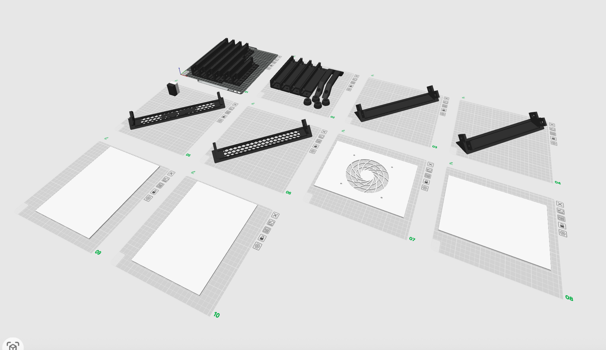
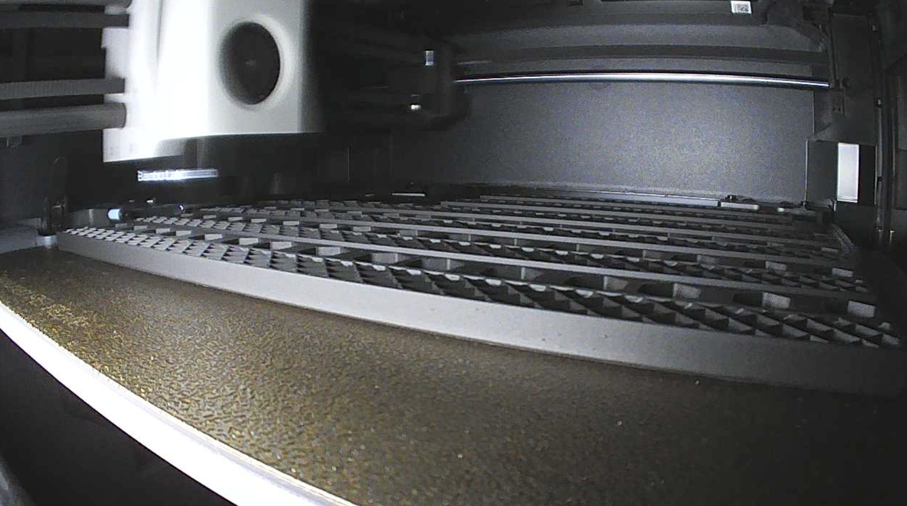

# Cooper'n'80s Photo Progress

> Visual documentation of the build process - because some things are better shown than explained.

## 🖨️ 3D Printing Progress

### Timeline

| Date | Milestone | Photos |
|------|-----------|--------|
| **Aug 17** | First prints started - Lab-Rax base components | [📸 2 photos](#august-17-2025) |

### Latest Photos

*Lab-Rax frame components prepared in Bambu Studio*

  
*Base frame components printing on Bambu P1S*

### August 17, 2025
**Milestone:** First prints started - Lab-Rax base components

*Lab-Rax frame components prepared in Bambu Studio*

  
*Base frame components printing on Bambu P1S*

---

## 🔧 Hardware Assembly

### Timeline
*No photos yet*

---

## 🏗️ Rack Completed

### Timeline
*No photos yet*

---

## 💻 Infrastructure Setup

### Timeline  
*No photos yet*

---

*"Progress is best measured in pictures and working prototypes."* 📸

**Latest Update:** August 17, 2025